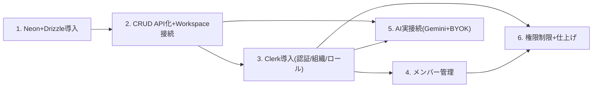

# バックエンド実装フェーズ 指示書（セクション分割プロンプト集）

このドキュメントは、モック実装フェーズ完了後の**バックエンド実装フェーズ**（Neon+DrizzleでのDB接続、Clerkでの認証・組織・権限、Vercel AI SDK + GeminiでのAI実接続）を、**一度に全部書くと内容がぶれるため、セクションごとに分割したプロンプト集**としてまとめたものです。

**使い方**: 新しいセッションを始めるとき、対応するセクションの「コピペ用プロンプト」をそのまま貼り付けて開始する。1セッション = 1セクションを基本とする（セクションが大きすぎる場合は、そのセクションの中でさらに分割してよいが、他セクションのスコープには手を広げない）。

---

## 0. 前提・共通ルール

### 着手前に必ず読むもの

- `CLAUDE.md`（本リポジトリの常時適用ルール。バックエンド実装フェーズに入ったことは反映済み）
- `docs/mock-implementation-plan.md`（特に §2.3 データモデル・§2.4 認証/組織/権限・§2.5 AI機能・§2.6 技術スタック・§8 対象外一覧）
- 本ファイル（`docs/backend-implementation-plan.md`）の該当セクション

### 全セクション共通ルール

1. **スコープを守る**: 担当セクションに書かれた「スコープ内」以外のファイル・機能には手を広げない。着手中に他セクションの作業が必要だと気づいた場合は、実装を進めず一旦ユーザーに確認する
2. **既存のモック挙動をいきなり壊さない**: `data/*.json` を読むモック実装から実データ接続への切替は、指定されたセクションで明示的に行う。他のセクションでは並存させてよい（例: DBスキーマだけ作る段階ではまだ`app/page.tsx`はJSON読み込みのままでよい）
3. **依存関係の追加は `npm install` 経由で最新版を入れる**。バージョンを決め打ちしない
4. **環境変数**は `.env.local`（gitignore対象、コミットしない）に置き、必要なキー名は `.env.example` に追記する
5. **DBスキーマの変更は必ず drizzle-kit のマイグレーションを通す**（Neonのテーブルを直接いじらない）
6. **完了条件**: `npm run test` / `npm run lint` / `npm run build` をグリーンにする。新しいロジックには対応するテストを追加する（DB/Clerk/Geminiの実接続部分はモック・スタブ化して高速に回せるテストを基本とし、実サービスへの接続確認は`npm run dev`での手動確認でよい）
7. **完了したら本ファイルの該当セクションのステータス表を `✅` に更新し、実装メモ（新規ファイル・決定事項・次セクションへの引き継ぎ事項）を追記する**（`docs/mock-implementation-plan.md` §9・§10 の記録スタイルを踏襲）
8. 不明点・仕様判断が必要な箇所は、独断で決めずユーザーに確認する（特にUIに影響する変更は `designing-workspace-ui` スキルの SSoT エスカレーション規律に従う）

### セクション一覧・依存関係

| # | セクション | 依存 | ステータス |
| - | ---------- | ---- | ---------- |
| 1 | Neon + Drizzle 導入（スキーマ・マイグレーション・シード） | なし | ✅ 完了 |
| 2 | Category/Project/Task/Member の CRUD API 化 + Workspace.tsx のAPI接続切替 | §1 | ✅ 完了 |
| 3 | Clerk 導入（認証・組織・ロール） | §2 | ⬜ 未着手 |
| 4 | 組織メンバー管理の実装（Clerk Organizations経由） | §3 | ⬜ 未着手 |
| 5 | AI実接続（Gemini + Vercel AI SDK、BYOKキー管理含む） | §2, §3 | ⬜ 未着手 |
| 6 | ロールに基づく操作制限 + 仕上げ | §3, §4 | ⬜ 未着手 |



---

## セクション1: Neon + Drizzle 導入（スキーマ・マイグレーション・シード）

### 目的

`lib/schema.ts` の zod スキーマ（Category/Member/Project/Task）に対応する Drizzle スキーマを新設し、Neon（Postgres）に接続してマイグレーション・シード投入まで通す。

### スコープ内

- `@neondatabase/serverless`・`drizzle-orm`・`drizzle-kit` の導入
- `db/schema.ts`（Drizzleテーブル定義。Category/Member/Project/Task、およびリレーション）の新設
- `drizzle.config.ts` の作成、マイグレーション生成・適用の動作確認
- `data/*.json` の内容をDBに投入するシードスクリプト
- 接続クライアント（`db/client.ts` 等）の作成

### スコープ外（次セクション以降）

- API Route Handler化（§2で実施）
- `app/page.tsx` / `Workspace.tsx` の実データ切替（§2で実施）
- 認証・組織スコープでのマルチテナント設計（§3で実施。本セクションではまず単一データセットのテーブル設計でよい）

### テスト方針

- Drizzleスキーマの型・制約に関する軽量ユニットテスト（実DB接続が無くても検証できるものはVitestで）
- 実Neon接続を要するテストはCIで毎回回さなくてよい形にする（`.env.local`未設定時はスキップする等）

### コピペ用プロンプト

```text
docs/backend-implementation-plan.md のセクション1「Neon + Drizzle 導入」を実装してください。
着手前に CLAUDE.md と docs/mock-implementation-plan.md の §2.3・§2.6 を読んでください。

やること:
- drizzle-orm / drizzle-kit / @neondatabase/serverless を導入する
- lib/schema.ts の Category/Member/Project/Task に対応する Drizzle スキーマを db/schema.ts に定義する
  （テーブル名・カラム設計は lib/schema.ts の zod スキーマに準拠する。進捗率など派生値はカラムに持たせず、
  lib/computed/projects.ts と同様アプリ側で計算する方針を踏襲する）
- drizzle.config.ts を作成し、マイグレーション生成・適用ができることを確認する
- data/categories.json, data/members.json, data/projects.json の内容を投入するシードスクリプトを作成する
- Neonの接続情報は .env.local に置き、.env.example にキー名を追記する（実際の接続文字列はユーザーに確認する）

やらないこと（他セクションのスコープ）:
- API Route Handler の作成
- app/page.tsx / Workspace.tsx の実データ切替
- Clerkによる認証・組織スコープ設計

完了したら npm run test / lint / build をグリーンにし、
docs/backend-implementation-plan.md のセクション1のステータスを更新し、実装メモを追記してください。
不明点（Neonプロジェクトの接続情報など、ユーザー側の作業が必要なもの）があれば先に確認してください。
```

### 実装メモ（2026-07-03 完了）

**事前確認事項への回答（ユーザー）**: Neonプロジェクトは未作成のため、接続文字列は本セクションでは設定しない（スキーマ・マイグレーション・シードの実装のみ先行し、実DBへの適用はユーザーが `.env.local` を設定した後に行う）。接続ドライバは `@neondatabase/serverless` の HTTP モード（`drizzle-orm/neon-http`）を採用（Vercel Serverless/Edge 両対応、アプリ・マイグレーション双方でシンプルに使えるため）。

**新規ファイル**:

| ファイル | 内容 |
| -------- | ---- |
| `db/schema.ts` | Drizzle テーブル定義。`categories`/`members`/`projects`/`tasks`（+ `role`/`project_status` の pgEnum）。カラム名・型は `lib/schema.ts` の zod スキーマに一対一対応させ、進捗率等の派生値は持たない |
| `db/client.ts` | `drizzle-orm/neon-http` の接続クライアント（`db` をexport）。`DATABASE_URL` 未設定時は import 時に分かりやすいエラーを投げる。`tsx` 実行時に `.env.local` を読み込む処理もここに集約 |
| `db/seed-data.ts` | `data/*.json`（zod パース済み）を insert 行に変換する純粋関数 `buildSeedRows`（DB接続不要、ユニットテスト対象） |
| `db/seed.ts` | `npm run db:seed` の実体。全削除→再投入（開発用シードのため冪等性重視、差分マイグレーションではない） |
| `drizzle.config.ts` | `drizzle-kit` の設定（`dialect: "postgresql"`、`out: "./drizzle"`） |
| `drizzle/0000_init_schema.sql` + `drizzle/meta/` | `drizzle-kit generate` で生成した初回マイグレーション（動作確認済み、実DB未適用） |
| `.env.example` | `DATABASE_URL` のキー名を追記（`.gitignore` は `.env*` を無視しつつ `.env.example` のみ `!` で除外するよう修正） |
| `.env.local` | `DATABASE_URL=`（空。ユーザーがNeonプロジェクト作成後に値を設定する） |
| `__tests__/db-schema.test.ts` | テーブル・カラム定義の軽量ユニットテスト（実DB接続不要） |
| `__tests__/db-seed-data.test.ts` | `buildSeedRows` のユニットテスト（実DB接続不要） |
| `__tests__/db-integration.test.ts` | 実Neon接続を要する統合テスト。`DATABASE_URL` 未設定時は `describe.skipIf` で自動スキップ |
| `vitest.config.ts` | `.env.local` を読み込むよう変更（`DATABASE_URL` が設定されていれば統合テストも実行できるようにするため） |

**決定事項・判断メモ**:

- **`deadline`/`dueDate`/`assigneeId` はすべて `text` カラム（NOT NULL, デフォルト `''`）**とし、zod スキーマの `z.string()` にそのまま対応させた。`assigneeId` は未アサイン時に空文字を持つ仕様（zod側もnull不可の string）のため、DBレベルの外部キー制約は付けていない（`""` という実在しない参照値を許容する必要があるため）。参照整合性はアプリ層で担保する既存方針を踏襲。セクション2でAPI層のバリデーションを設計する際に、この前提を引き継ぐこと
- **`sortOrder`（`projects`/`tasks`）を zod スキーマにない列として追加した**。モックのJSON配列順がそのままカンバン内・タスク一覧内の表示順として使われており（`Workspace.tsx` の `moveProject`）、Postgresの行には順序保証がないため、配列順を復元する目的の技術的な列として導入した。「進捗率など派生値はカラムに持たせない」という指示とは別種の列（派生計算ではなく生の並び順state）と判断した。シード時は現在のJSON配列順をそのまま採番している。セクション2でD&D並び替えAPIを設計する際に、この列の更新方針（1件ずつ振り直すか、間隔を空けて採番するか等）を改めて検討すること
- `createdAt`（全テーブル）は監査目的の一般的な列として追加。UI・zodスキーマには影響しない
- マイグレーション生成（`drizzle-kit generate`）はダミーの接続文字列で動作確認済み（生成はDB非接続でも可能なため）。実DBへの適用（`drizzle-kit migrate`）・シード投入（`npm run db:seed`）は、ユーザーがNeonプロジェクトを作成し `.env.local` に `DATABASE_URL` を設定した後に、以下のコマンドで実行する:
  ```bash
  npm run db:migrate
  npm run db:seed
  ```
- ローカル開発環境の注意点: リポジトリの `node_modules` は Node 20.19 未満だと `vitest.config.ts` の読み込みに失敗する（既知の問題、本ドキュメント冒頭§5.2参照）。本セクションの作業はNode 23.7.0で実施・確認した

**次セクション（§2）への引き継ぎ**:

- `db/client.ts` の `db` と `db/schema.ts` のテーブル定義をそのままRoute Handlerから利用できる
- `assigneeId`/`dueDate`/`deadline` の空文字表現・`sortOrder` 列の存在を前提にAPI設計を行うこと
- `app/page.tsx`・`Workspace.tsx` はまだ `data/*.json` を読む実装のまま変更していない（本セクションのスコープ外）
- ユーザーがNeonプロジェクトを作成し次第、`.env.local` に接続文字列を設定 → `npm run db:migrate` → `npm run db:seed` を実行して実データ投入まで確認すること

---

## セクション2: Category/Project/Task/Member の CRUD API 化 + Workspace.tsx のAPI接続切替

### 目的

§1で作ったDBスキーマに対し、Next.jsのRoute Handler（`app/api/**`）でCRUD APIを実装し、`Workspace.tsx` のクライアント状態管理を、モックJSON直読みからAPI経由のデータ取得・更新に置き換える。

### スコープ内

- `app/api/categories`, `app/api/projects`, `app/api/projects/[id]/tasks` 等のRoute Handler（GET/POST/PATCH/DELETE）
- `app/page.tsx` を、JSON importではなくDBからの初期データ取得（Server Component内でDrizzleクライアントを直接叩く、または上記APIを叩く）に変更
- `Workspace.tsx` 内の各種ハンドラ（`addProject`/`deleteProject`/`moveProject`/`addTask`/`updateTaskField`/`toggleTaskDone`/`deleteTask`/`addCategory`/`deleteCategory`等）を、ローカルstate更新のみから、API呼び出し + 状態更新（楽観的更新 or 再検証）に変更
- `data/*.json` は当面残してよいが、実運用パスとしては使わなくなることを明記する

### スコープ外

- Clerkによる認証・組織スコープでのデータ分離（§3以降。本セクションでは単一ワークスペース前提のままでよい）
- AI関連API（§5）

### テスト方針

- Route HandlerのユニットテストをVitest + `NextRequest`相当のモックで作成（DB部分はテスト用のDrizzleインスタンス、またはリポジトリ層を関数分離してモック可能にする）
- 既存の `lib/computed/projects.ts` 等の派生計算ロジックはAPI層でもそのまま再利用する（ロジックの二重実装をしない）

### コピペ用プロンプト

```text
docs/backend-implementation-plan.md のセクション2「CRUD API化 + Workspace.tsx のAPI接続切替」を実装してください。
着手前に CLAUDE.md、docs/mock-implementation-plan.md、および
docs/backend-implementation-plan.md のセクション1の実装メモを読んでください。

やること:
- Category/Project/Task/Member それぞれの CRUD を Next.js の Route Handler（app/api/**）として実装する
  （§1で作ったDrizzleスキーマ・接続クライアントを使う）
- app/page.tsx をDBからの初期データ取得に切り替える
- components/workspace/Workspace.tsx の各ハンドラをAPI呼び出しに置き換える
  （UIの見た目・操作感は変えない。楽観的更新の方針はあなたの判断で提案し、実装前に一度方針をユーザーに確認する）
- lib/computed/projects.ts 等の既存の派生計算ロジックは変更・重複実装しない

やらないこと（他セクションのスコープ）:
- Clerk認証・組織スコープでのデータ分離
- AI関連のAPI実装

完了したら npm run test / lint / build をグリーンにし、
docs/backend-implementation-plan.md のセクション2のステータスを更新し、実装メモを追記してください。
```

### 実装メモ（2026-07-03 完了）

**楽観的更新の方針（着手前にユーザーに確認・承認済み）**:

- 全ハンドラ共通で「ローカル state を即座に更新（体感は従来通り）→ 裏で API を fire-and-forget
  呼び出し → 失敗したら黙ってロールバック（`console.error` に記録するのみ、トースト等のUI追加は
  しない）」というパターンを採用（`lib/optimistic.ts` の `runOptimistic`/`removeById`/`insertAt`）
- 作成系のID発行はサーバー生成を待たずクライアント側で行う（`crypto.randomUUID()`、
  `Date.now()` から変更。同一ミリ秒での衝突がDBのユニーク制約違反として表面化するのを防ぐため）。
  作成直後に選択状態にするなど、今までの「作った瞬間に反映される」体感を壊さないための決定
- プロジェクトのD&D並び替え（`moveProject`）は、移動確定後の `projects` 配列全体の並び順
  （`status`/`sortOrder`）をまとめて `PATCH /api/projects/reorder` で送る「全体再採番」方式を採用
  （プロジェクト数が少ないポートフォリオ管理ツールという前提で、書き込み量よりも実装の
  シンプルさ・確実さを優先）
- カテゴリ削除は、既存UI文言（「配下のプロジェクトも含めて完全に削除され、元に戻せません」）
  通り、API側（`deleteCategoryCascade`）でプロジェクト→カテゴリの順にカスケード削除する。
  `categories→projects` のFK制約は `onDelete: "restrict"` のまま維持し（誤操作の歯止めとして
  残す）、アプリ層で子を先に消す方式にしたためスキーマ変更・新規マイグレーションは不要だった。
  タスクは `tasks→projects` の `onDelete: "cascade"` で自動的に消える。あわせて、モック段階では
  存在しなかった「カテゴリ削除時にローカル `projects` state からも配下プロジェクトを除去する」
  処理を `Workspace.tsx` の `deleteCategory` に追加した（実バックエンドで実際に消える以上、
  ローカル state に残したままだと画面上に幽霊プロジェクトが残ってしまうため）

**新規ファイル**:

| ファイル | 内容 |
| -------- | ---- |
| `db/repositories/categories.ts`・`members.ts`・`projects.ts`・`tasks.ts` | Route Handler から `db`（Drizzle）を直接叩かせず、必ず経由させるリポジトリ層。テスト時に `vi.mock` でモジュールごと差し替えられるようにし、実DB接続なしで Route Handler をユニットテストできるようにする狙い |
| `app/api/categories/route.ts`（GET/POST）・`[id]/route.ts`（PATCH/DELETE） | カテゴリCRUD。DELETEは配下プロジェクト・タスクをカスケード削除 |
| `app/api/members/route.ts`（GET/POST）・`[id]/route.ts`（PATCH/DELETE） | メンバーCRUD。`Workspace.tsx` からは読み取り（`app/page.tsx` 経由のDB直読み）のみ利用し、作成/更新/削除はどのUIからも呼ばれない（メンバー管理UIは§4でClerk Organizations経由に実装するため、現時点ではAPIとしての完成のみ） |
| `app/api/projects/route.ts`（GET/POST）・`[id]/route.ts`（PATCH/DELETE）・`reorder/route.ts`（PATCH） | プロジェクトCRUD＋D&D並び替え用の一括reorder API |
| `app/api/projects/[id]/tasks/route.ts`（POST）・`app/api/tasks/[id]/route.ts`（PATCH/DELETE） | タスクの作成・更新・削除（一覧取得は `GET /api/projects` のネストされた `tasks` を利用するため別途用意していない） |
| `lib/api/schemas.ts` | Route Handler のリクエストボディ検証用 zod スキーマ（作成時は `id` 必須、更新時は各項目 optional） |
| `lib/api/respond.ts` | `{ error: string }` 形式のエラーレスポンスを統一するヘルパー |
| `lib/api/workspace-client.ts` | `Workspace.tsx`（クライアントコンポーネント）から Route Handler を呼ぶ fetch ラッパー。non-OK時はサーバーの `error` メッセージで throw する |
| `lib/optimistic.ts` | 楽観的更新の共通ユーティリティ（`runOptimistic`/`removeById`/`insertAt`） |
| `__tests__/api-categories.test.ts`・`api-members.test.ts`・`api-projects.test.ts`・`api-tasks.test.ts` | Route Handlerのユニットテスト。リポジトリ層を `vi.mock` してDB接続なしで検証（バリデーションエラー・404・正常系） |
| `__tests__/optimistic.test.ts`・`workspace-client.test.ts` | 上記2ユーティリティのユニットテスト |

**変更したファイル**:

- `app/page.tsx`: `data/categories.json`/`members.json`/`projects.json` の読み込みをやめ、`db/repositories/*` を直接呼ぶ async Server Component に変更。`export const dynamic = "force-dynamic"` を追加（後述の理由）。`data/workspace.json`（ワークスペース名・アイコン）はDB化していないため従来通りJSON読み込みのまま
- `components/workspace/Workspace.tsx`: `addProject`/`deleteProject`/`moveProject`/`addTask`/`updateTaskField`/`toggleTaskDone`/`deleteTask`/`addCategory`/`deleteCategory`/`updateDeadline` を、上記の楽観的更新方針に沿ってAPI呼び出し版に変更。UIの見た目・操作感は変更していない
- `lib/data/factories.ts`: `createEmptyProject`/`createMinimalTask` のID生成を `Date.now()` → `crypto.randomUUID()` に変更（上記「楽観的更新の方針」参照）
- `db/client.ts`: `db` を、実際にクエリを発行するまで接続生成（`DATABASE_URL` の検証）を遅延する Proxy に変更（後述の「詰まった点」参照）
- `__tests__/page.test.tsx`: `app/page.tsx` が async Server Component になったため、`render(<Page />)` ではなく `render(await Page())` に変更。あわせて `db/repositories/*` を `vi.mock` し、実DB接続なしでテストできるようにした

**詰まった点と対処**:

- `db/client.ts` は元々（§1実装時点で）モジュール読み込み時点で即座に `DATABASE_URL` を検証・接続生成していた。§1時点では `db/client` を実際に import するのはスクリプト（`db/seed.ts`）とテストのみだったため問題化しなかったが、本セクションで `app/page.tsx`・Route Handler群が（リポジトリ層経由で）`db/client` を import するようになった結果、`next build` の「ページデータ収集」フェーズがモジュールを評価した瞬間に `DATABASE_URL` 未設定エラーで**ビルド自体が失敗する**ようになった。ユーザーはまだNeonプロジェクトを作成しておらず `.env.local` の `DATABASE_URL` は空のままのため、これでは本セクションの完了条件（`npm run build` グリーン）を満たせない。対処として `db/client.ts` の `db` を、実際にプロパティアクセス（クエリ発行）された瞬間まで接続生成を遅延する `Proxy` に変更した。あわせて `app/page.tsx` に `export const dynamic = "force-dynamic"` を追加し、`next build` が `/` を静的プリレンダリングしようとして（＝ビルド時にDBへ実アクセスして）失敗するのも防いだ。どちらも§1で作成したファイルへの変更だが、本セクション自身の完了条件を満たすために必要な修正であり、新機能の追加ではないためスコープ内の対応と判断した
- `drizzle-orm/neon-http` は複数ステートメントにまたがるトランザクションをサポートしないため（§1のメモの通り）、`deleteCategoryCascade`・`reorderProjects` はいずれも逐次クエリ実行にしている（`db/seed.ts` と同じ方針）。並び替えAPI（`reorderProjects`）は1回のリクエストで複数件を逐次UPDATEするため、途中で失敗すると部分的にしか反映されない可能性があるが、内部ツールの利用規模・障害時は再読み込みで復旧できることを踏まえ許容している

**次セクション（§3）への引き継ぎ**:

- `Workspace.tsx` の `members` はまだ `app/page.tsx` 経由のDB読み取り専用で、追加・削除・ロール変更のUIは無い（§4のスコープ）。`app/api/members/**` のPOST/PATCH/DELETEはAPIとしては実装済みなので、§4ではUIの実装とAPI側の呼び出し配線が主な作業になる
- 認証・組織スコープ（`orgId`）は本セクションでは一切導入していない（単一ワークスペース前提のまま）。§3でDBにorgIdを追加する際は、`db/schema.ts` の各テーブルへのカラム追加＋マイグレーション、リポジトリ層の各関数へのorgIdフィルタ追加、Route Handlerでの認可チェック追加が必要になる
- `data/categories.json`/`members.json`/`projects.json` は実運用パスとしては使われなくなった（`app/page.tsx` はDB直読みに切替済み）。シード投入（`npm run db:seed`）用途でのみ引き続き参照する。`data/workspace.json` は未DB化のため現役
- ロールに基づく操作制限（削除はOwner/Adminのみ等）は本セクションでは実装していない（§6のスコープ、モック段階同様バッジ表示のみ）
- ユーザーがNeonプロジェクトを作成し `.env.local` に `DATABASE_URL` を設定した後、`npm run db:migrate` → `npm run db:seed` → `npm run dev` で実データでの動作確認を行うこと（§1から持ち越しのTODO。本セクションではRoute Handler・リポジトリ層はすべてリポジトリ層モックでのユニットテストのみ実施しており、実Neon接続での動作確認はまだ行っていない）

---

## セクション3: Clerk 導入（認証・組織・ロール）

### 目的

Clerkを導入し、Google認証・Organizations・Owner/Admin/Memberロールを実配線する。「組織 = ワークスペース」という既存決定（`docs/mock-implementation-plan.md` §2.4, §9.2）に基づき、組織所属を必須化する。

### スコープ内

- `@clerk/nextjs` 導入、`middleware.ts` によるルート保護
- サインイン/サインアップ、組織作成/組織参加のオンボーディング導線
- `components/workspace/OrgSwitcher.tsx`・`GlobalHeader.tsx`のユーザーメニューを実データ連携に変更（ダミー組織/ロール表示から実際のClerk Organizationsに接続）
- §2で作ったDB上のデータに組織ID（`orgId`）を紐付け、組織単位でデータをスコープする

### スコープ外

- 組織メンバーの招待・削除・ロール変更UI（§4で実施）
- ロールに基づく操作制限の実装（§6で実施。本セクションではロール情報の取得・表示まででよい）

### テスト方針

- Clerkはテスト用インスタンス/モックを使い、実際のOAuthフローはVitestでは検証しない（手動確認は`npm run dev`で行う）
- ルート保護（未認証時のリダイレクト等）のロジックは可能な範囲でユニットテスト化する

### コピペ用プロンプト

```text
docs/backend-implementation-plan.md のセクション3「Clerk導入（認証・組織・ロール）」を実装してください。
着手前に CLAUDE.md、docs/mock-implementation-plan.md の §2.4・§9.2、
および docs/backend-implementation-plan.md のセクション1・2の実装メモを読んでください。

やること:
- @clerk/nextjs を導入し、middleware.ts でルートを保護する
- サインイン/サインアップ、組織作成・組織参加のオンボーディング導線を実装する
  （「組織 = ワークスペース」、組織所属必須、個人ワークスペースは無し、という既存決定に従う）
- components/workspace/OrgSwitcher.tsx・GlobalHeader.tsx のユーザーメニューを実際のClerk
  Organizations/ユーザー情報に接続する（ダミー定数を置き換える）
- §2で作成したDBのデータに組織ID（orgId）を紐付け、組織単位でデータをスコープする
- ロールは Owner/Admin/Member の3段階（Clerk標準ロール）をそのまま使う

やらないこと（他セクションのスコープ）:
- メンバーの招待・削除・ロール変更UI
- ロールに基づく操作制限（削除をOwner/Adminのみにする等）

必要な環境変数（Clerkの公開鍵・シークレットキー等）はユーザーに確認し、.env.local / .env.example を整備してください。

完了したら npm run test / lint / build をグリーンにし、
docs/backend-implementation-plan.md のセクション3のステータスを更新し、実装メモを追記してください。
```

---

## セクション4: 組織メンバー管理の実装（Clerk Organizations経由）

### 目的

`data/members.json` の固定データに代わり、Clerk Organizationsのメンバー一覧・招待・削除・ロール変更を実配線する。

### スコープ内

- メンバー一覧の取得をClerk Organizations APIに置き換え（`Workspace.tsx`の`members` propsの供給元を変更）
- メンバー招待・削除・ロール変更のUI（`SettingsDialog.tsx`等、既存パターンに沿った新規ダイアログでよい）
- タスク担当者選択（`InlineSelectField`によるメンバー選択）はそのまま、供給元だけ実データに変更

### スコープ外

- ロールに基づく操作制限（§6）

### テスト方針

- Clerk Organizations APIをモックしたユニットテスト
- 既存の担当者選択UI（`ProjectDetailPane.tsx`の`TaskDetailContent`）の変更は最小限に留め、回帰がないことをテストで確認する

### コピペ用プロンプト

```text
docs/backend-implementation-plan.md のセクション4「組織メンバー管理の実装」を実装してください。
着手前に CLAUDE.md、docs/mock-implementation-plan.md の §2.3・§6・§9.3、
および docs/backend-implementation-plan.md のセクション3の実装メモを読んでください。

やること:
- data/members.json への依存をやめ、メンバー一覧をClerk Organizations APIから取得する
- メンバーの招待・削除・ロール変更UIを実装する（designing-workspace-uiスキルの規律に従い、
  既存の業務Dialogパターンを踏襲する。新しい編集UIの流派を増やさない）
- タスク担当者選択（InlineSelectFieldによるメンバー選択、assigneeId参照の仕組み）は変更せず、
  供給元のみ実データに差し替える

やらないこと（他セクションのスコープ）:
- ロールに基づく操作制限の実装

完了したら npm run test / lint / build をグリーンにし、
docs/backend-implementation-plan.md のセクション4のステータスを更新し、実装メモを追記してください。
```

---

## セクション5: AI実接続（Gemini + Vercel AI SDK、BYOKキー管理含む）

### 目的

モックのダミーロジック（`lib/labels.ts`の`AI_SUMMARY_TEMPLATES`・`AI_CHAT_GREETING`・`buildAiTaskProposalTitles`等）を、Vercel AI SDK（`@ai-sdk/google`）経由の実Gemini API呼び出しに置き換える。BYOK（ユーザー個人のAPIキー、Clerk private metadata保存）も本セクションで実装する。

### スコープ内

- `ai`（Vercel AI SDK）・`@ai-sdk/google` の導入
- `components/workspace/ApiKeySettingsDialog.tsx` の保存処理を、Clerkユーザーのprivate metadataへの読み書きAPI（サーバーサイドのみアクセス可）に接続
- Pane3 AI進捗サマリー（`ProjectDashboardPane.tsx`の`AiSummaryCard`）を実LLM呼び出しに置き換え
- Pane4 AIアシスタント（`ProjectDetailPane.tsx`の`AiAssistantPanel`）を実LLM呼び出しに置き換え。タスクの追加・編集・完了チェックはtool calling（ツール呼び出し）で実行する
- タスク洗い出し機能（`TaskProposalBubble`、複数タスク一括提案 + チェックボックス確認）も実LLMベースの提案に置き換える
- APIキー未設定時のフォールバック挙動（エラーメッセージ表示等）

### スコープ外

- ロールに基づく操作制限（§6）

### テスト方針

- Gemini API呼び出しはモック化してVitestでテストする（実APIキーが無くてもテストが通ること）
- tool callingの入出力スキーマ（zod）はユニットテストで検証する
- 既存の「削除はAIから実行不可、手動のみ」という制約（`docs/mock-implementation-plan.md` §2.5）は実装後も維持する

### コピペ用プロンプト

```text
docs/backend-implementation-plan.md のセクション5「AI実接続（Gemini + Vercel AI SDK、BYOK）」を
実装してください。着手前に CLAUDE.md、docs/mock-implementation-plan.md の §2.5・§10、
および docs/backend-implementation-plan.md のセクション2・3の実装メモを読んでください。

やること:
- ai（Vercel AI SDK）・@ai-sdk/google を導入する
- components/workspace/ApiKeySettingsDialog.tsx の保存処理を、Clerkユーザーのprivate metadataへの
  読み書きAPI（サーバーサイドのみアクセス可）に接続する
- Pane3のAI進捗サマリー（AiSummaryCard）を実Gemini呼び出しに置き換える
- Pane4のAIアシスタント（AiAssistantPanel）を実Gemini呼び出しに置き換える。タスクの追加・編集・
  完了チェックはtool callingで実行する（削除はAIから実行不可のまま、手動のみという制約は維持する）
- タスク洗い出し機能（TaskProposalBubbleでの複数提案＋チェックボックス確認＋追加確定というUI/UXは
  変更せず）を、実LLMによるタスク候補生成に置き換える
- APIキー未設定時は、その旨をチャット上でわかりやすく案内するフォールバックを用意する

やらないこと（他セクションのスコープ）:
- ロールに基づく操作制限

完了したら npm run test / lint / build をグリーンにし（Gemini呼び出しはモック化してテストが
実APIキー無しで通るようにする）、docs/backend-implementation-plan.md のセクション5の
ステータスを更新し、実装メモを追記してください。
```

---

## セクション6: ロールに基づく操作制限 + 仕上げ

### 目的

Owner/Admin/Memberのロールに基づく操作制限（例: プロジェクト削除はOwner/Adminのみ）を実装し、バックエンド実装フェーズの仕上げ（ドキュメント更新・デプロイ準備）を行う。

### スコープ内

- 削除系操作（プロジェクト削除・タスク削除・カテゴリ削除・メンバー削除等）のロール制限をUI（disabled化等）とAPI（サーバー側の権限チェック）の両方に実装
- 制限の詳細（どの操作をどのロールに許可するか）は、既存の「バッジ表示のみ」から一歩進めるにあたり、事前にユーザーに確認する（`docs/mock-implementation-plan.md` §9.4で「バックエンドフェーズで権限モデルの詳細が固まった時点で作り直す」とされていた箇所）
- `README.md` / `CLAUDE.md` の最終更新（バックエンド実装フェーズ完了の反映、環境構築手順の追記）
- Vercelへのデプロイ手順の整備（環境変数一覧、Neon/Clerk/Geminiの本番設定）

### スコープ外

- 新規機能追加（本セクションはフェーズの締めくくり）

### テスト方針

- 権限チェックロジック（誰が何をできるか）はロールごとのケースを網羅したユニットテストを書く
- API側の権限チェックが漏れていないか（UIの制限だけでなくAPIでも弾かれるか）を統合テストで確認する

### コピペ用プロンプト

```text
docs/backend-implementation-plan.md のセクション6「ロールに基づく操作制限 + 仕上げ」を
実装してください。着手前に CLAUDE.md、docs/mock-implementation-plan.md の §2.4・§9.4、
および docs/backend-implementation-plan.md のセクション1〜5の実装メモをすべて読んでください。

やること:
- 削除系操作（プロジェクト削除・タスク削除・カテゴリ削除・メンバー削除等）についてロールに基づく
  操作制限を、UI（ボタンのdisabled化等、既存のcanAddProjectパターンを踏襲）とAPI
  （サーバー側の権限チェック）の両方に実装する。どの操作をどのロールに許可するかは実装前に
  ユーザーに確認する
- README.md / CLAUDE.md を、バックエンド実装フェーズ完了後の状態に合わせて更新する
  （環境構築手順、必要な環境変数、デプロイ手順を含む）
- Vercelへのデプロイに必要な設定（環境変数一覧など）をドキュメント化する

完了したら npm run test / lint / build をグリーンにし、
docs/backend-implementation-plan.md のセクション6のステータスを更新し、実装メモを追記してください。
また docs/mock-implementation-plan.md の該当箇所（§8の「対象外」一覧）も、
完了した項目がわかるように更新してください。
```
