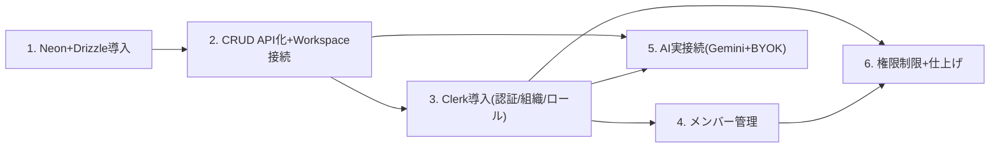

# バックエンド実装フェーズ 指示書（セクション分割プロンプト集）

このドキュメントは、モック実装フェーズ完了後の**バックエンド実装フェーズ**（Neon+DrizzleでのDB接続、Clerkでの認証・組織・権限、Vercel AI SDK + GeminiでのAI実接続）を、**一度に全部書くと内容がぶれるため、セクションごとに分割したプロンプト集**としてまとめたものです。

**使い方**: 新しいセッションを始めるとき、対応するセクションの「コピペ用プロンプト」をそのまま貼り付けて開始する。1セッション = 1セクションを基本とする（セクションが大きすぎる場合は、そのセクションの中でさらに分割してよいが、他セクションのスコープには手を広げない）。

---

## 0. 前提・共通ルール

### 着手前に必ず読むもの

- `CLAUDE.md`（本リポジトリの常時適用ルール。バックエンド実装フェーズに入ったことは反映済み）
- `docs/mock-implementation-plan.md`（特に §2.3 データモデル・§2.4 認証/組織/権限・§2.5 AI機能・§2.6 技術スタック・§8 対象外一覧）
- 本ファイル（`docs/backend-implementation-plan.md`）の該当セクション

### 全セクション共通ルール

1. **スコープを守る**: 担当セクションに書かれた「スコープ内」以外のファイル・機能には手を広げない。着手中に他セクションの作業が必要だと気づいた場合は、実装を進めず一旦ユーザーに確認する
2. **既存のモック挙動をいきなり壊さない**: `data/*.json` を読むモック実装から実データ接続への切替は、指定されたセクションで明示的に行う。他のセクションでは並存させてよい（例: DBスキーマだけ作る段階ではまだ`app/page.tsx`はJSON読み込みのままでよい）
3. **依存関係の追加は `npm install` 経由で最新版を入れる**。バージョンを決め打ちしない
4. **環境変数**は `.env.local`（gitignore対象、コミットしない）に置き、必要なキー名は `.env.example` に追記する
5. **DBスキーマの変更は必ず drizzle-kit のマイグレーションを通す**（Neonのテーブルを直接いじらない）
6. **完了条件**: `npm run test` / `npm run lint` / `npm run build` をグリーンにする。新しいロジックには対応するテストを追加する（DB/Clerk/Geminiの実接続部分はモック・スタブ化して高速に回せるテストを基本とし、実サービスへの接続確認は`npm run dev`での手動確認でよい）
7. **完了したら本ファイルの該当セクションのステータス表を `✅` に更新し、実装メモ（新規ファイル・決定事項・次セクションへの引き継ぎ事項）を追記する**（`docs/mock-implementation-plan.md` §9・§10 の記録スタイルを踏襲）
8. 不明点・仕様判断が必要な箇所は、独断で決めずユーザーに確認する（特にUIに影響する変更は `designing-workspace-ui` スキルの SSoT エスカレーション規律に従う）

### セクション一覧・依存関係

| #   | セクション                                                                | 依存   | ステータス |
| --- | ------------------------------------------------------------------------- | ------ | ---------- |
| 1   | Neon + Drizzle 導入（スキーマ・マイグレーション・シード）                 | なし   | ✅ 完了    |
| 2   | Category/Project/Task/Member の CRUD API 化 + Workspace.tsx のAPI接続切替 | §1     | ✅ 完了    |
| 3   | Clerk 導入（認証・組織・ロール）                                          | §2     | ✅ 完了    |
| 4   | 組織メンバー管理の実装（Clerk Organizations経由）                         | §3     | ✅ 完了    |
| 5   | AI実接続（Gemini + Vercel AI SDK、BYOKキー管理含む）                      | §2, §3 | ⬜ 未着手  |
| 6   | ロールに基づく操作制限 + 仕上げ                                           | §3, §4 | ⬜ 未着手  |



---

## セクション1: Neon + Drizzle 導入（スキーマ・マイグレーション・シード）

### 目的

`lib/schema.ts` の zod スキーマ（Category/Member/Project/Task）に対応する Drizzle スキーマを新設し、Neon（Postgres）に接続してマイグレーション・シード投入まで通す。

### スコープ内

- `@neondatabase/serverless`・`drizzle-orm`・`drizzle-kit` の導入
- `db/schema.ts`（Drizzleテーブル定義。Category/Member/Project/Task、およびリレーション）の新設
- `drizzle.config.ts` の作成、マイグレーション生成・適用の動作確認
- `data/*.json` の内容をDBに投入するシードスクリプト
- 接続クライアント（`db/client.ts` 等）の作成

### スコープ外（次セクション以降）

- API Route Handler化（§2で実施）
- `app/page.tsx` / `Workspace.tsx` の実データ切替（§2で実施）
- 認証・組織スコープでのマルチテナント設計（§3で実施。本セクションではまず単一データセットのテーブル設計でよい）

### テスト方針

- Drizzleスキーマの型・制約に関する軽量ユニットテスト（実DB接続が無くても検証できるものはVitestで）
- 実Neon接続を要するテストはCIで毎回回さなくてよい形にする（`.env.local`未設定時はスキップする等）

### コピペ用プロンプト

```text
docs/backend-implementation-plan.md のセクション1「Neon + Drizzle 導入」を実装してください。
着手前に CLAUDE.md と docs/mock-implementation-plan.md の §2.3・§2.6 を読んでください。

やること:
- drizzle-orm / drizzle-kit / @neondatabase/serverless を導入する
- lib/schema.ts の Category/Member/Project/Task に対応する Drizzle スキーマを db/schema.ts に定義する
  （テーブル名・カラム設計は lib/schema.ts の zod スキーマに準拠する。進捗率など派生値はカラムに持たせず、
  lib/computed/projects.ts と同様アプリ側で計算する方針を踏襲する）
- drizzle.config.ts を作成し、マイグレーション生成・適用ができることを確認する
- data/categories.json, data/members.json, data/projects.json の内容を投入するシードスクリプトを作成する
- Neonの接続情報は .env.local に置き、.env.example にキー名を追記する（実際の接続文字列はユーザーに確認する）

やらないこと（他セクションのスコープ）:
- API Route Handler の作成
- app/page.tsx / Workspace.tsx の実データ切替
- Clerkによる認証・組織スコープ設計

完了したら npm run test / lint / build をグリーンにし、
docs/backend-implementation-plan.md のセクション1のステータスを更新し、実装メモを追記してください。
不明点（Neonプロジェクトの接続情報など、ユーザー側の作業が必要なもの）があれば先に確認してください。
```

### 実装メモ（2026-07-03 完了）

**事前確認事項への回答（ユーザー）**: Neonプロジェクトは未作成のため、接続文字列は本セクションでは設定しない（スキーマ・マイグレーション・シードの実装のみ先行し、実DBへの適用はユーザーが `.env.local` を設定した後に行う）。接続ドライバは `@neondatabase/serverless` の HTTP モード（`drizzle-orm/neon-http`）を採用（Vercel Serverless/Edge 両対応、アプリ・マイグレーション双方でシンプルに使えるため）。

**新規ファイル**:

| ファイル                                         | 内容                                                                                                                                                                                               |
| ------------------------------------------------ | -------------------------------------------------------------------------------------------------------------------------------------------------------------------------------------------------- |
| `db/schema.ts`                                   | Drizzle テーブル定義。`categories`/`members`/`projects`/`tasks`（+ `role`/`project_status` の pgEnum）。カラム名・型は `lib/schema.ts` の zod スキーマに一対一対応させ、進捗率等の派生値は持たない |
| `db/client.ts`                                   | `drizzle-orm/neon-http` の接続クライアント（`db` をexport）。`DATABASE_URL` 未設定時は import 時に分かりやすいエラーを投げる。`tsx` 実行時に `.env.local` を読み込む処理もここに集約               |
| `db/seed-data.ts`                                | `data/*.json`（zod パース済み）を insert 行に変換する純粋関数 `buildSeedRows`（DB接続不要、ユニットテスト対象）                                                                                    |
| `db/seed.ts`                                     | `npm run db:seed` の実体。全削除→再投入（開発用シードのため冪等性重視、差分マイグレーションではない）                                                                                              |
| `drizzle.config.ts`                              | `drizzle-kit` の設定（`dialect: "postgresql"`、`out: "./drizzle"`）                                                                                                                                |
| `drizzle/0000_init_schema.sql` + `drizzle/meta/` | `drizzle-kit generate` で生成した初回マイグレーション（動作確認済み、実DB未適用）                                                                                                                  |
| `.env.example`                                   | `DATABASE_URL` のキー名を追記（`.gitignore` は `.env*` を無視しつつ `.env.example` のみ `!` で除外するよう修正）                                                                                   |
| `.env.local`                                     | `DATABASE_URL=`（空。ユーザーがNeonプロジェクト作成後に値を設定する）                                                                                                                              |
| `__tests__/db-schema.test.ts`                    | テーブル・カラム定義の軽量ユニットテスト（実DB接続不要）                                                                                                                                           |
| `__tests__/db-seed-data.test.ts`                 | `buildSeedRows` のユニットテスト（実DB接続不要）                                                                                                                                                   |
| `__tests__/db-integration.test.ts`               | 実Neon接続を要する統合テスト。`DATABASE_URL` 未設定時は `describe.skipIf` で自動スキップ                                                                                                           |
| `vitest.config.ts`                               | `.env.local` を読み込むよう変更（`DATABASE_URL` が設定されていれば統合テストも実行できるようにするため）                                                                                           |

**決定事項・判断メモ**:

- **`deadline`/`dueDate`/`assigneeId` はすべて `text` カラム（NOT NULL, デフォルト `''`）**とし、zod スキーマの `z.string()` にそのまま対応させた。`assigneeId` は未アサイン時に空文字を持つ仕様（zod側もnull不可の string）のため、DBレベルの外部キー制約は付けていない（`""` という実在しない参照値を許容する必要があるため）。参照整合性はアプリ層で担保する既存方針を踏襲。セクション2でAPI層のバリデーションを設計する際に、この前提を引き継ぐこと
- **`sortOrder`（`projects`/`tasks`）を zod スキーマにない列として追加した**。モックのJSON配列順がそのままカンバン内・タスク一覧内の表示順として使われており（`Workspace.tsx` の `moveProject`）、Postgresの行には順序保証がないため、配列順を復元する目的の技術的な列として導入した。「進捗率など派生値はカラムに持たせない」という指示とは別種の列（派生計算ではなく生の並び順state）と判断した。シード時は現在のJSON配列順をそのまま採番している。セクション2でD&D並び替えAPIを設計する際に、この列の更新方針（1件ずつ振り直すか、間隔を空けて採番するか等）を改めて検討すること
- `createdAt`（全テーブル）は監査目的の一般的な列として追加。UI・zodスキーマには影響しない
- マイグレーション生成（`drizzle-kit generate`）はダミーの接続文字列で動作確認済み（生成はDB非接続でも可能なため）。実DBへの適用（`drizzle-kit migrate`）・シード投入（`npm run db:seed`）は、ユーザーがNeonプロジェクトを作成し `.env.local` に `DATABASE_URL` を設定した後に、以下のコマンドで実行する:
  ```bash
  npm run db:migrate
  npm run db:seed
  ```
- ローカル開発環境の注意点: リポジトリの `node_modules` は Node 20.19 未満だと `vitest.config.ts` の読み込みに失敗する（既知の問題、本ドキュメント冒頭§5.2参照）。本セクションの作業はNode 23.7.0で実施・確認した

**次セクション（§2）への引き継ぎ**:

- `db/client.ts` の `db` と `db/schema.ts` のテーブル定義をそのままRoute Handlerから利用できる
- `assigneeId`/`dueDate`/`deadline` の空文字表現・`sortOrder` 列の存在を前提にAPI設計を行うこと
- `app/page.tsx`・`Workspace.tsx` はまだ `data/*.json` を読む実装のまま変更していない（本セクションのスコープ外）
- ユーザーがNeonプロジェクトを作成し次第、`.env.local` に接続文字列を設定 → `npm run db:migrate` → `npm run db:seed` を実行して実データ投入まで確認すること

---

## セクション2: Category/Project/Task/Member の CRUD API 化 + Workspace.tsx のAPI接続切替

### 目的

§1で作ったDBスキーマに対し、Next.jsのRoute Handler（`app/api/**`）でCRUD APIを実装し、`Workspace.tsx` のクライアント状態管理を、モックJSON直読みからAPI経由のデータ取得・更新に置き換える。

### スコープ内

- `app/api/categories`, `app/api/projects`, `app/api/projects/[id]/tasks` 等のRoute Handler（GET/POST/PATCH/DELETE）
- `app/page.tsx` を、JSON importではなくDBからの初期データ取得（Server Component内でDrizzleクライアントを直接叩く、または上記APIを叩く）に変更
- `Workspace.tsx` 内の各種ハンドラ（`addProject`/`deleteProject`/`moveProject`/`addTask`/`updateTaskField`/`toggleTaskDone`/`deleteTask`/`addCategory`/`deleteCategory`等）を、ローカルstate更新のみから、API呼び出し + 状態更新（楽観的更新 or 再検証）に変更
- `data/*.json` は当面残してよいが、実運用パスとしては使わなくなることを明記する

### スコープ外

- Clerkによる認証・組織スコープでのデータ分離（§3以降。本セクションでは単一ワークスペース前提のままでよい）
- AI関連API（§5）

### テスト方針

- Route HandlerのユニットテストをVitest + `NextRequest`相当のモックで作成（DB部分はテスト用のDrizzleインスタンス、またはリポジトリ層を関数分離してモック可能にする）
- 既存の `lib/computed/projects.ts` 等の派生計算ロジックはAPI層でもそのまま再利用する（ロジックの二重実装をしない）

### コピペ用プロンプト

```text
docs/backend-implementation-plan.md のセクション2「CRUD API化 + Workspace.tsx のAPI接続切替」を実装してください。
着手前に CLAUDE.md、docs/mock-implementation-plan.md、および
docs/backend-implementation-plan.md のセクション1の実装メモを読んでください。

やること:
- Category/Project/Task/Member それぞれの CRUD を Next.js の Route Handler（app/api/**）として実装する
  （§1で作ったDrizzleスキーマ・接続クライアントを使う）
- app/page.tsx をDBからの初期データ取得に切り替える
- components/workspace/Workspace.tsx の各ハンドラをAPI呼び出しに置き換える
  （UIの見た目・操作感は変えない。楽観的更新の方針はあなたの判断で提案し、実装前に一度方針をユーザーに確認する）
- lib/computed/projects.ts 等の既存の派生計算ロジックは変更・重複実装しない

やらないこと（他セクションのスコープ）:
- Clerk認証・組織スコープでのデータ分離
- AI関連のAPI実装

完了したら npm run test / lint / build をグリーンにし、
docs/backend-implementation-plan.md のセクション2のステータスを更新し、実装メモを追記してください。
```

### 実装メモ（2026-07-03 完了）

**楽観的更新の方針（着手前にユーザーに確認・承認済み）**:

- 全ハンドラ共通で「ローカル state を即座に更新（体感は従来通り）→ 裏で API を fire-and-forget
  呼び出し → 失敗したら黙ってロールバック（`console.error` に記録するのみ、トースト等のUI追加は
  しない）」というパターンを採用（`lib/optimistic.ts` の `runOptimistic`/`removeById`/`insertAt`）
- 作成系のID発行はサーバー生成を待たずクライアント側で行う（`crypto.randomUUID()`、
  `Date.now()` から変更。同一ミリ秒での衝突がDBのユニーク制約違反として表面化するのを防ぐため）。
  作成直後に選択状態にするなど、今までの「作った瞬間に反映される」体感を壊さないための決定
- プロジェクトのD&D並び替え（`moveProject`）は、移動確定後の `projects` 配列全体の並び順
  （`status`/`sortOrder`）をまとめて `PATCH /api/projects/reorder` で送る「全体再採番」方式を採用
  （プロジェクト数が少ないポートフォリオ管理ツールという前提で、書き込み量よりも実装の
  シンプルさ・確実さを優先）
- カテゴリ削除は、既存UI文言（「配下のプロジェクトも含めて完全に削除され、元に戻せません」）
  通り、API側（`deleteCategoryCascade`）でプロジェクト→カテゴリの順にカスケード削除する。
  `categories→projects` のFK制約は `onDelete: "restrict"` のまま維持し（誤操作の歯止めとして
  残す）、アプリ層で子を先に消す方式にしたためスキーマ変更・新規マイグレーションは不要だった。
  タスクは `tasks→projects` の `onDelete: "cascade"` で自動的に消える。あわせて、モック段階では
  存在しなかった「カテゴリ削除時にローカル `projects` state からも配下プロジェクトを除去する」
  処理を `Workspace.tsx` の `deleteCategory` に追加した（実バックエンドで実際に消える以上、
  ローカル state に残したままだと画面上に幽霊プロジェクトが残ってしまうため）

**新規ファイル**:

| ファイル                                                                                               | 内容                                                                                                                                                                                                                        |
| ------------------------------------------------------------------------------------------------------ | --------------------------------------------------------------------------------------------------------------------------------------------------------------------------------------------------------------------------- |
| `db/repositories/categories.ts`・`members.ts`・`projects.ts`・`tasks.ts`                               | Route Handler から `db`（Drizzle）を直接叩かせず、必ず経由させるリポジトリ層。テスト時に `vi.mock` でモジュールごと差し替えられるようにし、実DB接続なしで Route Handler をユニットテストできるようにする狙い                |
| `app/api/categories/route.ts`（GET/POST）・`[id]/route.ts`（PATCH/DELETE）                             | カテゴリCRUD。DELETEは配下プロジェクト・タスクをカスケード削除                                                                                                                                                              |
| `app/api/members/route.ts`（GET/POST）・`[id]/route.ts`（PATCH/DELETE）                                | メンバーCRUD。`Workspace.tsx` からは読み取り（`app/page.tsx` 経由のDB直読み）のみ利用し、作成/更新/削除はどのUIからも呼ばれない（メンバー管理UIは§4でClerk Organizations経由に実装するため、現時点ではAPIとしての完成のみ） |
| `app/api/projects/route.ts`（GET/POST）・`[id]/route.ts`（PATCH/DELETE）・`reorder/route.ts`（PATCH）  | プロジェクトCRUD＋D&D並び替え用の一括reorder API                                                                                                                                                                            |
| `app/api/projects/[id]/tasks/route.ts`（POST）・`app/api/tasks/[id]/route.ts`（PATCH/DELETE）          | タスクの作成・更新・削除（一覧取得は `GET /api/projects` のネストされた `tasks` を利用するため別途用意していない）                                                                                                          |
| `lib/api/schemas.ts`                                                                                   | Route Handler のリクエストボディ検証用 zod スキーマ（作成時は `id` 必須、更新時は各項目 optional）                                                                                                                          |
| `lib/api/respond.ts`                                                                                   | `{ error: string }` 形式のエラーレスポンスを統一するヘルパー                                                                                                                                                                |
| `lib/api/workspace-client.ts`                                                                          | `Workspace.tsx`（クライアントコンポーネント）から Route Handler を呼ぶ fetch ラッパー。non-OK時はサーバーの `error` メッセージで throw する                                                                                 |
| `lib/optimistic.ts`                                                                                    | 楽観的更新の共通ユーティリティ（`runOptimistic`/`removeById`/`insertAt`）                                                                                                                                                   |
| `__tests__/api-categories.test.ts`・`api-members.test.ts`・`api-projects.test.ts`・`api-tasks.test.ts` | Route Handlerのユニットテスト。リポジトリ層を `vi.mock` してDB接続なしで検証（バリデーションエラー・404・正常系）                                                                                                           |
| `__tests__/optimistic.test.ts`・`workspace-client.test.ts`                                             | 上記2ユーティリティのユニットテスト                                                                                                                                                                                         |

**変更したファイル**:

- `app/page.tsx`: `data/categories.json`/`members.json`/`projects.json` の読み込みをやめ、`db/repositories/*` を直接呼ぶ async Server Component に変更。`export const dynamic = "force-dynamic"` を追加（後述の理由）。`data/workspace.json`（ワークスペース名・アイコン）はDB化していないため従来通りJSON読み込みのまま
- `components/workspace/Workspace.tsx`: `addProject`/`deleteProject`/`moveProject`/`addTask`/`updateTaskField`/`toggleTaskDone`/`deleteTask`/`addCategory`/`deleteCategory`/`updateDeadline` を、上記の楽観的更新方針に沿ってAPI呼び出し版に変更。UIの見た目・操作感は変更していない
- `lib/data/factories.ts`: `createEmptyProject`/`createMinimalTask` のID生成を `Date.now()` → `crypto.randomUUID()` に変更（上記「楽観的更新の方針」参照）
- `db/client.ts`: `db` を、実際にクエリを発行するまで接続生成（`DATABASE_URL` の検証）を遅延する Proxy に変更（後述の「詰まった点」参照）
- `__tests__/page.test.tsx`: `app/page.tsx` が async Server Component になったため、`render(<Page />)` ではなく `render(await Page())` に変更。あわせて `db/repositories/*` を `vi.mock` し、実DB接続なしでテストできるようにした

**詰まった点と対処**:

- `db/client.ts` は元々（§1実装時点で）モジュール読み込み時点で即座に `DATABASE_URL` を検証・接続生成していた。§1時点では `db/client` を実際に import するのはスクリプト（`db/seed.ts`）とテストのみだったため問題化しなかったが、本セクションで `app/page.tsx`・Route Handler群が（リポジトリ層経由で）`db/client` を import するようになった結果、`next build` の「ページデータ収集」フェーズがモジュールを評価した瞬間に `DATABASE_URL` 未設定エラーで**ビルド自体が失敗する**ようになった。ユーザーはまだNeonプロジェクトを作成しておらず `.env.local` の `DATABASE_URL` は空のままのため、これでは本セクションの完了条件（`npm run build` グリーン）を満たせない。対処として `db/client.ts` の `db` を、実際にプロパティアクセス（クエリ発行）された瞬間まで接続生成を遅延する `Proxy` に変更した。あわせて `app/page.tsx` に `export const dynamic = "force-dynamic"` を追加し、`next build` が `/` を静的プリレンダリングしようとして（＝ビルド時にDBへ実アクセスして）失敗するのも防いだ。どちらも§1で作成したファイルへの変更だが、本セクション自身の完了条件を満たすために必要な修正であり、新機能の追加ではないためスコープ内の対応と判断した
- `drizzle-orm/neon-http` は複数ステートメントにまたがるトランザクションをサポートしないため（§1のメモの通り）、`deleteCategoryCascade`・`reorderProjects` はいずれも逐次クエリ実行にしている（`db/seed.ts` と同じ方針）。並び替えAPI（`reorderProjects`）は1回のリクエストで複数件を逐次UPDATEするため、途中で失敗すると部分的にしか反映されない可能性があるが、内部ツールの利用規模・障害時は再読み込みで復旧できることを踏まえ許容している

**次セクション（§3）への引き継ぎ**:

- `Workspace.tsx` の `members` はまだ `app/page.tsx` 経由のDB読み取り専用で、追加・削除・ロール変更のUIは無い（§4のスコープ）。`app/api/members/**` のPOST/PATCH/DELETEはAPIとしては実装済みなので、§4ではUIの実装とAPI側の呼び出し配線が主な作業になる
- 認証・組織スコープ（`orgId`）は本セクションでは一切導入していない（単一ワークスペース前提のまま）。§3でDBにorgIdを追加する際は、`db/schema.ts` の各テーブルへのカラム追加＋マイグレーション、リポジトリ層の各関数へのorgIdフィルタ追加、Route Handlerでの認可チェック追加が必要になる
- `data/categories.json`/`members.json`/`projects.json` は実運用パスとしては使われなくなった（`app/page.tsx` はDB直読みに切替済み）。シード投入（`npm run db:seed`）用途でのみ引き続き参照する。`data/workspace.json` は未DB化のため現役
- ロールに基づく操作制限（削除はOwner/Adminのみ等）は本セクションでは実装していない（§6のスコープ、モック段階同様バッジ表示のみ）
- ユーザーがNeonプロジェクトを作成し `.env.local` に `DATABASE_URL` を設定した後、`npm run db:migrate` → `npm run db:seed` → `npm run dev` で実データでの動作確認を行うこと（§1から持ち越しのTODO。本セクションではRoute Handler・リポジトリ層はすべてリポジトリ層モックでのユニットテストのみ実施しており、実Neon接続での動作確認はまだ行っていない）

---

## セクション3: Clerk 導入（認証・組織・ロール）

### 目的

Clerkを導入し、Google認証・Organizations・Owner/Admin/Memberロールを実配線する。「組織 = ワークスペース」という既存決定（`docs/mock-implementation-plan.md` §2.4, §9.2）に基づき、組織所属を必須化する。

### スコープ内

- `@clerk/nextjs` 導入、`middleware.ts` によるルート保護
- サインイン/サインアップ、組織作成/組織参加のオンボーディング導線
- `components/workspace/OrgSwitcher.tsx`・`GlobalHeader.tsx`のユーザーメニューを実データ連携に変更（ダミー組織/ロール表示から実際のClerk Organizationsに接続）
- §2で作ったDB上のデータに組織ID（`orgId`）を紐付け、組織単位でデータをスコープする

### スコープ外

- 組織メンバーの招待・削除・ロール変更UI（§4で実施）
- ロールに基づく操作制限の実装（§6で実施。本セクションではロール情報の取得・表示まででよい）

### テスト方針

- Clerkはテスト用インスタンス/モックを使い、実際のOAuthフローはVitestでは検証しない（手動確認は`npm run dev`で行う）
- ルート保護（未認証時のリダイレクト等）のロジックは可能な範囲でユニットテスト化する

### コピペ用プロンプト

```text
docs/backend-implementation-plan.md のセクション3「Clerk導入（認証・組織・ロール）」を実装してください。
着手前に CLAUDE.md、docs/mock-implementation-plan.md の §2.4・§9.2、
および docs/backend-implementation-plan.md のセクション1・2の実装メモを読んでください。

やること:
- @clerk/nextjs を導入し、middleware.ts でルートを保護する
- サインイン/サインアップ、組織作成・組織参加のオンボーディング導線を実装する
  （「組織 = ワークスペース」、組織所属必須、個人ワークスペースは無し、という既存決定に従う）
- components/workspace/OrgSwitcher.tsx・GlobalHeader.tsx のユーザーメニューを実際のClerk
  Organizations/ユーザー情報に接続する（ダミー定数を置き換える）
- §2で作成したDBのデータに組織ID（orgId）を紐付け、組織単位でデータをスコープする
- ロールは Owner/Admin/Member の3段階（Clerk標準ロール）をそのまま使う

やらないこと（他セクションのスコープ）:
- メンバーの招待・削除・ロール変更UI
- ロールに基づく操作制限（削除をOwner/Adminのみにする等）

必要な環境変数（Clerkの公開鍵・シークレットキー等）はユーザーに確認し、.env.local / .env.example を整備してください。

完了したら npm run test / lint / build をグリーンにし、
docs/backend-implementation-plan.md のセクション3のステータスを更新し、実装メモを追記してください。
```

### 実装メモ（2026-07-03 完了）

**事前確認事項への回答（ユーザー）**:

- 認証方式は Google のみ（メール/パスワード等は無効のまま）
- Clerk の Organizations 機能を有効化し、「Membership required」（個人アカウント無効、組織所属必須）を選択
- ロールは Owner/Admin/Member の3段階を維持したいが、Clerk 標準は Admin/Member の2段階のみで、組織作成者には既定で Admin が自動付与される。そこでユーザーが Clerk Dashboard で `org:owner` というカスタムロールを新規作成し（Admin と同じ全権限を付与）、「Role sets」→「Primary Role Set」の **Creator's initial role** を `org:owner` に変更してもらった。これにより組織作成者は Owner、招待されたメンバーの既定ロールは Member（`org:member`、Default role）のままになる
- Clerk のキー（Publishable/Secret）はユーザーから受領し `.env.local` に設定済み

**新規ファイル**:

| ファイル                                                                     | 内容                                                                                                                                                                                                                                            |
| ---------------------------------------------------------------------------- | ----------------------------------------------------------------------------------------------------------------------------------------------------------------------------------------------------------------------------------------------- |
| `proxy.ts`（Next.js 16 で `middleware.ts` から名称変更。挙動は同じ）         | `clerkMiddleware()` でラップし、`lib/auth/route-guard.ts` の判定結果に応じて `NextResponse.next()`/`redirect()`/`auth.protect()` を呼び分ける                                                                                                   |
| `lib/auth/route-guard.ts`                                                    | ルート保護の判定ロジック（未サインイン→`requireAuth`、組織未所属→`/onboarding`、`/sign-in`・`/sign-up`・`/onboarding`への到達可否）を Clerk/Next の実行環境から切り離した純粋関数 `decideRouteGuard` として実装。ユニットテストしやすくする狙い |
| `lib/api/auth.ts`                                                            | Route Handler 用の `requireOrgId()`。Clerk の `auth()` から `userId`/`orgId` を取得し、`{ ok: true, orgId }` か `{ ok: false, response }`（401/403のNextResponse）を返す                                                                        |
| `app/sign-in/[[...sign-in]]/page.tsx`・`app/sign-up/[[...sign-up]]/page.tsx` | Clerk の `<SignIn/>`・`<SignUp/>` プリビルトコンポーネントをそのまま利用（独自フォームは実装しない）                                                                                                                                            |
| `app/onboarding/page.tsx`                                                    | 組織作成・組織参加のオンボーディング。Clerk の `<OrganizationList hidePersonal />` を利用し、独自の作成/参加フォームは実装しない                                                                                                                |
| `__tests__/route-guard.test.ts`                                              | `decideRouteGuard` の全分岐（8パターン）のユニットテスト                                                                                                                                                                                        |
| `__tests__/api-auth.test.ts`                                                 | `requireOrgId` のユニットテスト（`@clerk/nextjs/server` の `auth` をモック）                                                                                                                                                                    |
| `__tests__/org-switcher.test.tsx`・`__tests__/global-header.test.tsx`        | `OrgSwitcher`・`GlobalHeader`のユーザーメニューのユニットテスト（Clerkフックをモックし、組織切替・ロール表示・サインアウト・プロフィール表示・組織新規作成の呼び出しを検証）                                                                    |

**変更したファイル**:

- `app/layout.tsx`: `<ClerkProvider>`（`@clerk/localizations` の `jaJP` で日本語化、`appearance.variables` でワークスペースのトークン色に合わせる）で全体をラップ
- `components/workspace/OrgSwitcher.tsx`: `DUMMY_ORGS` を削除し、`useOrganization`/`useOrganizationList`（現在の組織・所属組織一覧・`setActive`）に接続。ロールは Clerk のロールキー（`org:owner`等）から `lib/schema.ts` の `Role` 型に変換する `toRole` を追加。「組織を新規作成」メニューから `useClerk().openCreateOrganization()`（Clerkのモーダル）を開けるようにした
- `components/workspace/GlobalHeader.tsx`: `UserMenu` のダミーの「プロフィール」「ログアウト」を、`useUser()`（Avatar画像・表示名）・`useClerk()`（`openUserProfile()`・`signOut({ redirectUrl: "/sign-in" })`）に接続
- `db/schema.ts`: `categories`/`projects`/`tasks` に `orgId`（`text`, NOT NULL, インデックス付き）を追加。`tasks.orgId` は `projects.orgId` の非正規化コピー（タスク単体の更新・削除時にJOINなしで組織所有権を検証するため）。`members` には追加していない（後述）
- `db/repositories/categories.ts`・`projects.ts`・`tasks.ts`: 全関数の第一引数に `orgId` を追加し、`where` 句で組織スコープを強制（一覧取得だけでなく、更新・削除・並び替えも対象IDが自組織のものかを都度検証する。他組織のIDを推測して送っても404/効果なしになる）
- `db/seed-data.ts`・`db/seed.ts`: `buildSeedRows` に `orgId` 引数を追加。シード投入先の組織は環境変数 `SEED_ORG_ID`（`.env.local`）で指定する方式に変更
- `app/api/categories/**`・`app/api/projects/**`・`app/api/tasks/**`: 各 Route Handler の冒頭で `requireOrgId()` を呼び、`orgId` をリポジトリ層に渡すよう変更
- `app/page.tsx`: `auth()`（`@clerk/nextjs/server`）から `orgId` を取得し、`listCategories`/`listProjectsWithTasks` に渡す。`orgId` が無い場合は `/onboarding` へ `redirect`（`proxy.ts` を通過した時点で通常はありえないが、多層防御として実装）
- `.env.local`・`.env.example`: `NEXT_PUBLIC_CLERK_PUBLISHABLE_KEY`・`CLERK_SECRET_KEY`・`SEED_ORG_ID` を追加
- `__tests__/page.test.tsx`・`api-categories.test.ts`・`api-projects.test.ts`・`api-tasks.test.ts`・`db-schema.test.ts`・`db-seed-data.test.ts`: `orgId`/Clerkフックのモックを追加し、新しい関数シグネチャに追従
- `__tests__/setup.ts`: `@testing-library/react` の `cleanup()` を全テスト後に明示的に実行するよう追加（`vitest.config.ts` で `test.globals` を有効化していないため自動クリーンアップが効かず、`DropdownMenu` を複数回開閉するテストでDOMが残留し誤検出する問題への対処）

**詰まった点と対処**:

- **Clerkの標準ロールが2段階しかない**: Owner/Admin/Memberの3段階という既存決定に対し、Clerk標準は`org:admin`/`org:member`の2段階のみで、組織作成者には既定でAdminが付与される。ユーザーと相談し、Clerk Dashboard側でカスタムロール`org:owner`を作成して全権限を付与し、「Role sets」の「Creator's initial role」を`org:owner`に変更する運用でOwner/Admin/Memberの3段階を実現した（コード側の変更は不要、Dashboard設定のみ）
- **`DropdownMenuItem`の`onSelect`が発火しない**: `components/ui/dropdown-menu.tsx`はBase UI（`@base-ui/react/menu`）ベースだが、`Menu.Item`は`onSelect`という独自propを解釈せず、素通しして`<div>`のネイティブ`onSelect`（テキスト選択イベント、クリックでは発火しない）として扱われてしまう。そのため`OrgSwitcher.tsx`・`GlobalHeader.tsx`の新規追加分に加え、既存の`ProjectListPane.tsx`（プロジェクト削除メニュー）にあった同じ誤用も本セクションで発見し、あわせて`onClick`に修正した（削除ボタンが実質的に無反応だった既存バグ）
- **`DropdownMenuLabel`が単体で使うとクラッシュする**: Base UIの`Menu.GroupLabel`は`Menu.Group`内での使用が必須（`useMenuGroupRootContext`が無いと例外を投げる）。`GlobalHeader.tsx`の`UserMenu`は元々`DropdownMenuLabel`を`DropdownMenuGroup`で囲わずに使っており、実際にメニューを開くと（テストで発覚するまで）クラッシュする状態だった。`DropdownMenuGroup`で囲むよう修正した
- **`next build`時に`Property 'response' does not exist on type ...`**: `requireOrgId()`の戻り値を`{orgId: string} | {orgId: null, response}`という判別共用体にしたところ、`orgId`の型が単なる`string`（リテラル型でない）だったためTypeScriptの制御フロー解析で判別できなかった。`{ok: true, orgId} | {ok: false, response}`という明示的な真偽値の判別子に変更して解決した
- **Next.js 16 で `middleware.ts` が非推奨化**: `next build`が「`middleware`ファイル規約は非推奨、`proxy`を使うこと」という警告を出した（`node_modules/next/dist/docs/01-app/01-getting-started/16-proxy.md`参照。挙動は同一、ファイル名のみの変更）。`middleware.ts`を`proxy.ts`にリネームして解消した（Clerk公式ドキュメントも同様の対応を案内している）

**次セクション（§4）への引き継ぎ**:

- `members`テーブルには`orgId`を追加していない（既存の全ユーザー間でグローバル共有のまま）。これは意図的な判断で、§4で「メンバー一覧をClerk Organizations APIに置き換える」際に`db/repositories/members.ts`・`app/api/members/**`ごと置き換わる想定のため、今回`orgId`を追加してもすぐ無駄になる可能性が高いと判断し見送った。§4着手時は、DB上の`members`テーブル・関連API・リポジトリを削除しClerk Organizations APIに完全移行するか、それとも一部DB併用を続けるかをまず確認すること
- `OrgSwitcher.tsx`の組織一覧は`useOrganizationList({ userMemberships: { infinite: true } })`で取得しており、ページネーションは未実装（1ページ目のみ表示）。組織数が多い利用シーンが出てきたら「もっと読み込む」導線の追加を検討すること
- ロールの表示（`ROLE_LABEL`によるバッジ）は`OrgSwitcher.tsx`のみで、Pane1〜4等の他画面ではまだロード判定を使った操作制限は一切行っていない（§6のスコープ）
- `app/onboarding/page.tsx`は「組織未所属」の間だけ到達できる設計（`proxy.ts`が組織所属済みなら`/`へ戻す）。既に組織に所属している状態から追加で別の組織を作りたい場合は`OrgSwitcher.tsx`の「組織を新規作成」（`openCreateOrganization()`のモーダル）を使う導線にしている
- シード投入（`npm run db:seed`）は`SEED_ORG_ID`（Clerkで実際に組織を作成した後に確認できる`org_xxx`）の設定が前提になった。ユーザーがNeonプロジェクト作成・Clerkでの組織作成を終えたら、`.env.local`に`DATABASE_URL`・`SEED_ORG_ID`を設定し、`npm run db:migrate` → `npm run db:seed` → `npm run dev`で実データでの動作確認を行うこと（§1・§2から持ち越しのTODOに`SEED_ORG_ID`の設定が追加された形）

---

## セクション4: 組織メンバー管理の実装（Clerk Organizations経由）

### 目的

`data/members.json` の固定データに代わり、Clerk Organizationsのメンバー一覧・招待・削除・ロール変更を実配線する。

### スコープ内

- メンバー一覧の取得をClerk Organizations APIに置き換え（`Workspace.tsx`の`members` propsの供給元を変更）
- メンバー招待・削除・ロール変更のUI（`SettingsDialog.tsx`等、既存パターンに沿った新規ダイアログでよい）
- タスク担当者選択（`InlineSelectField`によるメンバー選択）はそのまま、供給元だけ実データに変更

### スコープ外

- ロールに基づく操作制限（§6）

### テスト方針

- Clerk Organizations APIをモックしたユニットテスト
- 既存の担当者選択UI（`ProjectDetailPane.tsx`の`TaskDetailContent`）の変更は最小限に留め、回帰がないことをテストで確認する

### コピペ用プロンプト

```text
docs/backend-implementation-plan.md のセクション4「組織メンバー管理の実装」を実装してください。
着手前に CLAUDE.md、docs/mock-implementation-plan.md の §2.3・§6・§9.3、
および docs/backend-implementation-plan.md のセクション3の実装メモを読んでください。

やること:
- data/members.json への依存をやめ、メンバー一覧をClerk Organizations APIから取得する
- メンバーの招待・削除・ロール変更UIを実装する（designing-workspace-uiスキルの規律に従い、
  既存の業務Dialogパターンを踏襲する。新しい編集UIの流派を増やさない）
- タスク担当者選択（InlineSelectFieldによるメンバー選択、assigneeId参照の仕組み）は変更せず、
  供給元のみ実データに差し替える

やらないこと（他セクションのスコープ）:
- ロールに基づく操作制限の実装

完了したら npm run test / lint / build をグリーンにし、
docs/backend-implementation-plan.md のセクション4のステータスを更新し、実装メモを追記してください。
```

### 実装メモ（2026-07-03 完了）

**事前確認事項への回答（ユーザー）**: §3の実装メモで持ち越しになっていた論点（DB上の`members`
テーブル・関連API・リポジトリをどう扱うか）について、「完全削除してClerk移行」を選択。
DBの`members`テーブル・`db/repositories/members.ts`・`data/members.json`は全て削除し、
メンバー関連の読み取り・書き込みをすべてClerk Organizations APIに一本化した。

**新規ファイル**:

| ファイル                                                        | 内容                                                                                                                                                                                                 |
| ---------------------------------------------------------------- | ------------------------------------------------------------------------------------------------------------------------------------------------------------------------------------------------- |
| `lib/auth/roles.ts`                                              | Clerkのロールキー（`org:owner`等）↔ アプリの`Role`型の相互変換（`toRole`/`toClerkRole`）。`OrgSwitcher.tsx`にあった`toRole`をここに集約し、`lib/clerk/org-members.ts`と共用する                       |
| `lib/clerk/org-members.ts`                                       | Clerk Organizations API（Backend SDK、`clerkClient()`）のラッパー。`listActiveMembers`（タスク担当者選択用、承諾済みメンバーのみ）・`listMembersForManagement`（メール・招待中一覧を含む管理UI用）・`inviteMember`・`updateMemberRole`・`removeMember`・`revokeInvitation` |
| `lib/api/http.ts`                                                | `lib/api/workspace-client.ts`にあった`apiFetch`（fetchラッパー本体）を切り出し、`lib/api/members-client.ts`と共用できるようにした                                                                    |
| `lib/api/members-client.ts`                                      | メンバー管理ダイアログ専用のfetchラッパー（`fetchOrgMembers`/`inviteMemberApi`/`updateMemberRoleApi`/`removeMemberApi`/`revokeInvitationApi`）。`Workspace.tsx`の`members`（担当者選択用）とは別データを扱うため独立させた |
| `app/api/members/route.ts`（GET/POST）・`[id]/route.ts`（PATCH/DELETE）・`invitations/[id]/route.ts`（DELETE） | Clerk Organizations経由のメンバーCRUD。GETはメンバー一覧＋招待中一覧をまとめて返す。POSTは招待（メンバー直接作成ではない）。`[id]`はClerkのユーザーID（`user_xxx`）、`invitations/[id]`はClerkの招待ID |
| `components/workspace/MemberManagementSection.tsx`               | 「ワークスペース設定」ダイアログ（`SettingsDialogContent`）に追加したメンバー管理セクション。既存のカテゴリ管理セクションと同じ「ScrollArea + 行リスト + 削除ボタン、下部にInputGroup + 追加ボタン」パターンを踏襲し、行ごとのロール変更に`Select`、招待フォームにメール入力+ロール`Select`+招待ボタン、招待中一覧に取り消しボタンを追加した |
| `__tests__/member-management.test.tsx`                            | `MemberManagementSection`のユニットテスト（`lib/api/members-client`をモック）                                                                                                                        |
| `drizzle/0002_amusing_iron_man.sql`                               | `members`テーブル・`role` enum のDROPマイグレーション（`drizzle-kit generate`で生成。動作確認済み、実DB未適用）                                                                                     |

**変更したファイル**:

- `db/schema.ts`: `members`テーブル・`roleEnum`・`MemberRow`/`NewMemberRow`を削除
- `db/seed-data.ts`・`db/seed.ts`: `data/members.json`の読み込み・`memberRows`の投入を削除。`data/projects.json`のタスクは元々`data/members.json`の`m1`〜`m5`を参照していたが、当該メンバーは存在しなくなったため全て空文字（未アサイン）にした（実メンバーへの再アサインはアプリの担当者選択UIから行う）
- `lib/schema.ts`: `membersSchema`（配列スキーマ、`data/members.json`専用）を削除。`memberSchema`/`Member`型/`roleSchema`/`Role`型はタスク担当者・メンバー管理UIの型として引き続き使用
- `app/page.tsx`: `listMembers()`（DB）→`listActiveMembers(orgId)`（`lib/clerk/org-members.ts`）に差し替え。`Workspace.tsx`への`initialMembers`の渡し方・型は変更なし
- `components/workspace/OrgSwitcher.tsx`: ローカル定義していた`toRole`を`lib/auth/roles.ts`のものに置き換え（重複ロジックの解消）
- `components/workspace/SettingsDialog.tsx`: `MemberManagementSection`を「プロジェクトカテゴリ」と「ワークスペース名」の間に追加。ダイアログ幅を`sm:max-w-md`→`sm:max-w-lg`に拡大（ロールSelect分の余白確保）
- `lib/api/schemas.ts`: `createMemberSchema`/`updateMemberSchema`（DB直接CRUD用）を`inviteMemberSchema`（email+role）/`updateMemberRoleSchema`（role）に置き換え
- `lib/api/respond.ts`: `clerkErrorResponse`を追加。Clerk Organizations APIが投げる`ClerkAPIResponseError`（重複招待・存在しないユーザー等）を`{error}`形式のレスポンスに変換する。Clerk由来のエラーでなければ再スローしNext.jsの既定処理に委ねる
- `lib/api/workspace-client.ts`: `apiFetch`本体を`lib/api/http.ts`に切り出し、re-export importに変更（ロジックの重複を避けるため）
- `__tests__/db-schema.test.ts`・`__tests__/db-seed-data.test.ts`・`__tests__/db-integration.test.ts`・`__tests__/schema.test.ts`・`__tests__/page.test.tsx`: `members`テーブル・`data/members.json`関連の記述を削除・更新
- `data/members.json`: 削除（`db/repositories/members.ts`も削除）

**設計判断メモ**:

- **`Member.id`にはClerkのユーザーID（`user_xxx`）を採用**した。組織メンバーシップID（`orgmem_xxx`）は退会→再参加で変わりうるが、タスクの`assigneeId`は「その人」への安定した参照であってほしいため、ユーザーIDを使う（`lib/clerk/org-members.ts`参照）
- **メンバー一覧取得を2種類に分けた**: `listActiveMembers`（タスク担当者選択向け、承諾済みメンバーのみ、`id`/`name`/`role`のみ）と`listMembersForManagement`（メンバー管理ダイアログ向け、メールアドレス・招待中一覧を含む）。前者は`app/page.tsx`からSSRで、後者は`MemberManagementSection`がダイアログを開くたびにクライアントから`GET /api/members`で取得する
- **「招待」と「メンバー追加」を区別した**: ClerkのOrganizations APIには「ユーザーを直接メンバーに追加する」API（`createOrganizationMembership`、既存Clerkユーザーのuser IDが必要）と「メールアドレスへの招待」API（`createOrganizationInvitation`、招待メールが送られ、相手が承諾して初めてメンバーになる）がある。案件管理ツールの利用者はメールアドレスしか分からないのが通常のため、後者（招待）を採用した。そのため「メンバー管理ダイアログ」には「メンバー一覧」と「招待中一覧」の2つのリストがある
- **メンバー管理ダイアログはmount時に一度だけフェッチする設計**にした（`open` propを受け取らない）。理由: このプロジェクトのDialog（base-ui）は`keepMounted: false`が既定のため、ダイアログを閉じると`DialogContent`配下は実際にReactツリーからアンマウントされ、再度開くと`MemberManagementSection`はまっさらな状態で再マウントされる。そのため`useEffect(() => {...}, [])`だけで「開くたびに最新化される」動作が自然に得られ、CLAUDE.mdが禁止する「props変更追従のEffect+setState」パターンを使わずに済んだ
- **メンバーの削除・ロール変更は`lib/optimistic.ts`の`runOptimistic`/`removeById`を再利用**し、`Workspace.tsx`の各ハンドラと同じ「即座にローカルstate反映→裏でAPI呼び出し→失敗時は黙ってロールバック」方針にした。招待の追加はレスポンス（作成された招待の情報）を受け取ってから一覧に足す方式にした（楽観的に先に足すには招待IDが確定しないため）
- **Clerk APIのエラーハンドリング**: DBリポジトリ層は「見つからなければ`null`を返す」規約だったが、Clerk Organizations APIは存在しないユーザーID・重複した招待等で例外を投げる。既存の`{error}`レスポンス規約を保つため`lib/api/respond.ts`に`clerkErrorResponse`を追加し、`ClerkAPIResponseError`のときだけステータス・メッセージを変換して返す（それ以外の例外は再スローしNext.jsの既定処理に委ねる、想定外エラーへの過剰な作り込みを避けるため）
- **ロールに基づく操作制限は実装していない**（本セクションのスコープ外、§6で対応）。現時点ではどのロールのユーザーでもメンバーの招待・削除・ロール変更ができる

**確認・検証状況**:

- `npm run test` / `lint` / `build`はグリーン（新規テスト`__tests__/api-members.test.ts`（書き直し）・`__tests__/member-management.test.tsx`を含む）
- `drizzle-kit generate`で`members`テーブル削除のマイグレーション（`drizzle/0002_amusing_iron_man.sql`）を生成し、SQL内容を確認済み。§1・§2・§3同様、実Neon未接続のため**実DBへの適用（`npm run db:migrate`）は未実施**
- 実Clerk組織・実DBに対するブラウザでの動作確認（招待メール送信・実際の承諾フロー・削除・ロール変更）は、ユーザーがNeonプロジェクトを作成し`.env.local`に`DATABASE_URL`・`SEED_ORG_ID`を設定した後に`npm run dev`で行うこと（§1〜§3から持ち越しのTODO）

**次セクション（§6）への引き継ぎ**:

- ロールに基づく操作制限を実装する際、メンバー管理の対象操作は「招待」「ロール変更」「削除」の3つ（`app/api/members/**`）。「自分自身を削除できてしまう」「組織に管理者が1人もいなくなる」等のガードは本セクションでは入れていない（Clerk側の制約に依存）ため、権限モデール設計時に必要か確認すること
- `data/projects.json`のタスクは全て`assigneeId: ""`（未アサイン）にリセットした。実際の動作確認時は、Clerkで組織にメンバーを招待・承諾させたのち、アプリの担当者選択UIから改めてアサインする必要がある

**追記（2026-07-03）**: §1〜§4で持ち越しになっていた「実Neon接続・マイグレーション適用・シード投入」のTODOを解消した。ユーザーがNeonプロジェクトを作成し `.env.local` に `DATABASE_URL` を設定 → `npm run db:migrate` を実行し、`categories`/`projects`/`tasks` の3テーブルが作成され `members` テーブルが存在しないことを確認（実DB統合テスト `__tests__/db-integration.test.ts` も自動実行され成功、`npm run test` 116件全てグリーン）。続けてClerkで組織を作成し `SEED_ORG_ID` を `.env.local` に設定 → `npm run db:seed` を実行し `categories=4 / projects=8 / tasks=22` を投入済み。`.claude/launch.json`（新規）を追加し、以降のセッションで `npm run dev` をPreviewツール経由で起動できるようにした。

---

## セクション5: AI実接続（Gemini + Vercel AI SDK、BYOKキー管理含む）

### 目的

モックのダミーロジック（`lib/labels.ts`の`AI_SUMMARY_TEMPLATES`・`AI_CHAT_GREETING`・`buildAiTaskProposalTitles`等）を、Vercel AI SDK（`@ai-sdk/google`）経由の実Gemini API呼び出しに置き換える。BYOK（ユーザー個人のAPIキー、Clerk private metadata保存）も本セクションで実装する。

### スコープ内

- `ai`（Vercel AI SDK）・`@ai-sdk/google` の導入
- `components/workspace/ApiKeySettingsDialog.tsx` の保存処理を、Clerkユーザーのprivate metadataへの読み書きAPI（サーバーサイドのみアクセス可）に接続
- Pane3 AI進捗サマリー（`ProjectDashboardPane.tsx`の`AiSummaryCard`）を実LLM呼び出しに置き換え
- Pane4 AIアシスタント（`ProjectDetailPane.tsx`の`AiAssistantPanel`）を実LLM呼び出しに置き換え。タスクの追加・編集・完了チェックはtool calling（ツール呼び出し）で実行する
- タスク洗い出し機能（`TaskProposalBubble`、複数タスク一括提案 + チェックボックス確認）も実LLMベースの提案に置き換える
- APIキー未設定時のフォールバック挙動（エラーメッセージ表示等）

### スコープ外

- ロールに基づく操作制限（§6）

### テスト方針

- Gemini API呼び出しはモック化してVitestでテストする（実APIキーが無くてもテストが通ること）
- tool callingの入出力スキーマ（zod）はユニットテストで検証する
- 既存の「削除はAIから実行不可、手動のみ」という制約（`docs/mock-implementation-plan.md` §2.5）は実装後も維持する

### コピペ用プロンプト

```text
docs/backend-implementation-plan.md のセクション5「AI実接続（Gemini + Vercel AI SDK、BYOK）」を
実装してください。着手前に CLAUDE.md、docs/mock-implementation-plan.md の §2.5・§10、
および docs/backend-implementation-plan.md のセクション2・3の実装メモを読んでください。

やること:
- ai（Vercel AI SDK）・@ai-sdk/google を導入する
- components/workspace/ApiKeySettingsDialog.tsx の保存処理を、Clerkユーザーのprivate metadataへの
  読み書きAPI（サーバーサイドのみアクセス可）に接続する
- Pane3のAI進捗サマリー（AiSummaryCard）を実Gemini呼び出しに置き換える
- Pane4のAIアシスタント（AiAssistantPanel）を実Gemini呼び出しに置き換える。タスクの追加・編集・
  完了チェックはtool callingで実行する（削除はAIから実行不可のまま、手動のみという制約は維持する）
- タスク洗い出し機能（TaskProposalBubbleでの複数提案＋チェックボックス確認＋追加確定というUI/UXは
  変更せず）を、実LLMによるタスク候補生成に置き換える
- APIキー未設定時は、その旨をチャット上でわかりやすく案内するフォールバックを用意する

やらないこと（他セクションのスコープ）:
- ロールに基づく操作制限

完了したら npm run test / lint / build をグリーンにし（Gemini呼び出しはモック化してテストが
実APIキー無しで通るようにする）、docs/backend-implementation-plan.md のセクション5の
ステータスを更新し、実装メモを追記してください。
```

---

## セクション6: ロールに基づく操作制限 + 仕上げ

### 目的

Owner/Admin/Memberのロールに基づく操作制限（例: プロジェクト削除はOwner/Adminのみ）を実装し、バックエンド実装フェーズの仕上げ（ドキュメント更新・デプロイ準備）を行う。

### スコープ内

- 削除系操作（プロジェクト削除・タスク削除・カテゴリ削除・メンバー削除等）のロール制限をUI（disabled化等）とAPI（サーバー側の権限チェック）の両方に実装
- 制限の詳細（どの操作をどのロールに許可するか）は、既存の「バッジ表示のみ」から一歩進めるにあたり、事前にユーザーに確認する（`docs/mock-implementation-plan.md` §9.4で「バックエンドフェーズで権限モデルの詳細が固まった時点で作り直す」とされていた箇所）
- `README.md` / `CLAUDE.md` の最終更新（バックエンド実装フェーズ完了の反映、環境構築手順の追記）
- Vercelへのデプロイ手順の整備（環境変数一覧、Neon/Clerk/Geminiの本番設定）

### スコープ外

- 新規機能追加（本セクションはフェーズの締めくくり）

### テスト方針

- 権限チェックロジック（誰が何をできるか）はロールごとのケースを網羅したユニットテストを書く
- API側の権限チェックが漏れていないか（UIの制限だけでなくAPIでも弾かれるか）を統合テストで確認する

### コピペ用プロンプト

```text
docs/backend-implementation-plan.md のセクション6「ロールに基づく操作制限 + 仕上げ」を
実装してください。着手前に CLAUDE.md、docs/mock-implementation-plan.md の §2.4・§9.4、
および docs/backend-implementation-plan.md のセクション1〜5の実装メモをすべて読んでください。

やること:
- 削除系操作（プロジェクト削除・タスク削除・カテゴリ削除・メンバー削除等）についてロールに基づく
  操作制限を、UI（ボタンのdisabled化等、既存のcanAddProjectパターンを踏襲）とAPI
  （サーバー側の権限チェック）の両方に実装する。どの操作をどのロールに許可するかは実装前に
  ユーザーに確認する
- README.md / CLAUDE.md を、バックエンド実装フェーズ完了後の状態に合わせて更新する
  （環境構築手順、必要な環境変数、デプロイ手順を含む）
- Vercelへのデプロイに必要な設定（環境変数一覧など）をドキュメント化する

完了したら npm run test / lint / build をグリーンにし、
docs/backend-implementation-plan.md のセクション6のステータスを更新し、実装メモを追記してください。
また docs/mock-implementation-plan.md の該当箇所（§8の「対象外」一覧）も、
完了した項目がわかるように更新してください。
```
