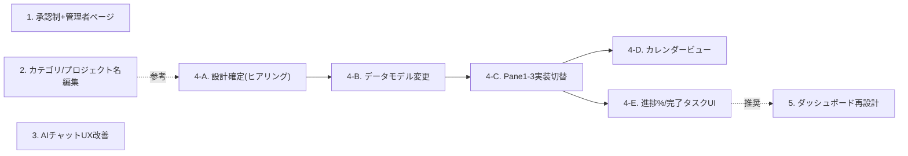

# フィードバック対応フェーズ 指示書（ステップ分割プロンプト集）

このドキュメントは、バックエンド実装フェーズ完了後にユーザーから出た実運用フィードバック12件を、**一度に全部やるとバグが起きるため、ある程度の塊（ステップ）ごとに分割したプロンプト集**としてまとめたものです。`docs/backend-implementation-plan.md` と同じ運用スタイルを踏襲します。

**使い方**: 新しいセッションを始めるとき、対応するステップの「コピペ用プロンプト」をそのまま貼り付けて開始する。1セッション = 1ステップを基本とする（ステップが大きすぎる場合は、さらに分割してよいが、他ステップのスコープには手を広げない）。ステップ4は特に規模が大きいため、あらかじめ 4-A 〜 4-E のサブステップに分割してある。

---

## 0. 前提・共通ルール

### 着手前に必ず読むもの

- `CLAUDE.md`（本リポジトリの常時適用ルール）
- `docs/mock-implementation-plan.md`（特に §2.3 データモデル・§2.4 認証/組織/権限・§2.5 AI機能・§2.6 技術スタック）
- `docs/backend-implementation-plan.md`（既存の認証・権限・AI実装の決定事項と実装メモ。矛盾しない形で進める）
- 本ファイル（`docs/feedback-implementation-plan.md`）の該当ステップ

### 全ステップ共通ルール

1. **スコープを守る**: 担当ステップに書かれた「スコープ内」以外のファイル・機能には手を広げない。他ステップの作業が必要だと気づいた場合は、実装を進めず一旦ユーザーに確認する
2. **「未確定事項」は独断で決めない**: 各ステップに「未確定事項（要確認）」を明記している。着手時にまずこれをユーザーに確認してから実装に入る
3. **UIに影響する変更は `designing-workspace-ui` スキルの SSoT エスカレーション規律に従う**（決定木 3a〜3d でユーザー確認、独断で SSoT を広げない）
4. **完了条件**: `npm run test` / `npm run lint` / `npm run build` をグリーンにする。新しいロジックには対応するテストを追加する
5. **完了したら本ファイルの該当ステップのステータス表を `✅` に更新し、実装メモ（新規ファイル・決定事項・次ステップへの引き継ぎ事項）を追記する**
6. **元のフィードバックとの対応関係を崩さない**: 各ステップ冒頭の「対応する元フィードバック」欄を見て、範囲がずれていないか確認しながら進める

### 元フィードバック12件 → ステップ対応表

| # | 元フィードバック（要約） | 対応ステップ |
| - | ------------------------------------------------------------ | -------------------- |
| 1 | 本番で誰でもGoogle認証から使えてしまう。承認制＋管理者専用ページが欲しい | ステップ1 |
| 2 | カテゴリ名を変更できるようにしたい | ステップ2 |
| 3 | テスト名（＝プロジェクト名）を変更できるようにしたい | ステップ2 |
| 4 | プロジェクトカテゴリとプロジェクトがわかりづらい。一階層でよい | ステップ4（4-A〜4-C） |
| 5 | AIチャットの送信をCommand+Enterにしてほしい | ステップ3 |
| 6 | チャット履歴はクリアボタンを押すまで消さない。トークン割合も表示 | ステップ3 |
| 7 | チャットですぐタスク化されるのをやめ、候補提示→任意追加にしたい | ステップ3 |
| 8 | 全体ダッシュボードがわかりづらい。ヒアリングしてほしい | ステップ5 |
| 9 | 2ペイン目にカレンダービュー（期日・完了タスクがわかる）を追加 | ステップ4（4-D） |
| 10 | 各タスクに進捗%を表示 | ステップ4（4-E） |
| 11 | 完了タスクは下に来るようにUI/UXを改善 | ステップ4（4-E） |
| 12 | 大きく仕様変更（1:プロジェクト名 / 2:大項目タスク / 3:小項目タスク+詳細 / 4:従来通り） | ステップ4（4-A〜4-E） |

> 項目4・9・10・11 は、内容的に項目12の4ペイン再構成と役割が重なる（特に2ペイン目の役割自体が変わるため）ため、**ヒアリング時にユーザーと合意の上、ステップ4に統合済み**。単独ステップとしては起こさない。

### ステップ一覧・依存関係

| #   | ステップ                                             | 依存        | ステータス |
| --- | ----------------------------------------------------- | ----------- | ---------- |
| 1   | 会員承認制 + サービス管理者専用ページ                 | なし        | ⬜ 未着手  |
| 2   | カテゴリ名・プロジェクト名のインライン編集            | なし        | ⬜ 未着手  |
| 3   | AIチャットUX改善（送信・履歴・トークン表示・提案制）  | なし        | ⬜ 未着手  |
| 4-A | 【設計確定】4ペイン再構成のヒアリング・仕様合意       | ステップ2推奨 | ⬜ 未着手  |
| 4-B | データモデル変更（タスク階層・カテゴリ一階層化）      | 4-A         | ⬜ 未着手  |
| 4-C | Pane1〜3 実装切替                                      | 4-B         | ⬜ 未着手  |
| 4-D | カレンダービュー実装                                  | 4-C         | ⬜ 未着手  |
| 4-E | タスク進捗%表示・完了タスクのUI仕上げ                 | 4-C         | ⬜ 未着手  |
| 5   | 全体ダッシュボードの再設計（ヒアリングベース）        | 4-E推奨     | ⬜ 未着手  |



**推奨する実施順序**: 1 → 2 → 3 → 4-A → 4-B → 4-C → 4-D/4-E → 5
（1〜3は互いに独立なので順不同で並行しても構わない。4系列は内部で厳密な順序依存があるため必ずA→B→C→D/Eの順で行う）

---

## ステップ1: 会員承認制 + サービス管理者専用ページ

### 対応する元フィードバック

> 本番環境では誰でもGoogleアカウント認証からサービスを利用できてしまうので、サービス運用者（私）に承認が来るようにしたい、必要であればサービス自体の管理者専用ページを作って管理したい

### 目的

現状、Clerkの標準Google OAuthでサインアップした瞬間に誰でもワークスペースを利用できてしまう。これを止め、サービス運営者（あなた）が明示的に承認するまで利用不可にする。承認待ちユーザーの確認・承認/却下を行う「サービス管理者専用ページ」を新設する。

### 背景・現状整理

- `lib/auth/permissions.ts` 等にある Owner/Admin/Member は**組織（Organization）内のロール**であり、「サービス全体の運営者」という概念は現状存在しない。今回、これとは独立した**プラットフォーム管理者**という新しい認可レイヤーを導入する
- `middleware.ts` は現状存在しない（認可チェックは各Route Handler内で個別に実施している）。承認ゲートは全ページ共通で効かせる必要があるため、本ステップで新設する

### スコープ内

- プラットフォーム管理者の判定ロジック（`lib/auth/platform-admin.ts` 等）。環境変数（例: `PLATFORM_ADMIN_EMAILS`）に列挙したメールアドレスと、Clerkの認証済みユーザーのメールアドレスを突き合わせる
- 新規ユーザーは既定で「承認待ち（pending）」。Clerkユーザーの `publicMetadata`（例: `approvalStatus: "pending" | "approved" | "rejected"`）で管理する
- `middleware.ts` を新設し、認証済みだが未承認のユーザーを `/pending-approval` 相当のページへリダイレクトする（プラットフォーム管理者自身は許可リストにより常に通過できるようにする＝締め出し防止のフェイルセーフ）
- `/admin` 配下にプラットフォーム管理者専用ページを新設。承認待ちユーザー一覧・承認/却下ボタン・承認済みユーザー一覧（利用停止操作を含む）を表示する
- 承認/却下を行う Route Handler（Clerk Backend SDK で `publicMetadata` を更新。`lib/clerk/org-members.ts` の実装パターンを参考にする）
- 未承認時に表示する「承認待ち」画面（ワークスペースの中身は見せない）

### スコープ外

- 組織内の Owner/Admin/Member ロールの仕組み自体の変更
- 承認完了・却下の自動メール通知（最初は管理者ページを都度確認する運用でよい。通知が欲しくなったら別ステップで検討）
- プラットフォーム管理者間の権限差（今回は全員同格でよい）

### 未確定事項（着手前に必ずユーザーに確認）

- プラットフォーム管理者のメールアドレス一覧（`info@afu.co.jp` を含む）を環境変数に列挙する方針でよいか、他に追加したいメールがあるか
- 却下（rejected）されたユーザーの体験（サインイン自体をブロックするか、専用の「利用できません」画面を出すか）
- 承認待ちの間、Organizationの新規作成・参加自体を止めるか、参加は許可してワークスペースの中身だけ見せないようにするか（推奨: 参加自体を止める方がシンプルで安全）
- 既存の稼働中ユーザー（既にサインアップ済みの人がいる場合）を、本ステップ適用時にどう扱うか（一括で「承認済み」にしてよいか、それとも全員pendingからやり直すか）

### テスト方針

- プラットフォーム管理者判定ロジックの単体テスト（allowlist判定、metadata判定）
- 承認/却下 Route Handler のテスト（Clerkクライアントはモック化）
- middleware本体の実行確認は `npm run dev` での手動確認でよい（Next.js middlewareの実行はVitestで再現しづらいため、ロジック部分を関数として切り出してユニットテスト可能にする）

### コピペ用プロンプト

```text
docs/feedback-implementation-plan.md のステップ1「会員承認制 + サービス管理者専用ページ」を実装してください。
着手前に CLAUDE.md と docs/mock-implementation-plan.md の §2.4、docs/backend-implementation-plan.md の
認証・権限まわりの実装メモを読んでください。

やること:
- lib/auth/platform-admin.ts（仮）: 環境変数 PLATFORM_ADMIN_EMAILS（カンマ区切り）に列挙したメールアドレスと、
  Clerkの現在ログイン中ユーザーのメールアドレスを突き合わせる判定関数を作る
- 新規サインアップ時、Clerkユーザーの publicMetadata.approvalStatus を既定で "pending" として扱う
  （Webhookで明示的にセットする方式でもよいし、未設定=pending とみなすロジックでもよい。判断してよい）
- middleware.ts を新設し、認証済みだが approvalStatus !== "approved" のユーザーを
  /pending-approval にリダイレクトする。ただしプラットフォーム管理者は常に通過させる
  （締め出し防止のフェイルセーフを必ず入れること）
- /admin 配下にプラットフォーム管理者専用ページを新設。プラットフォーム管理者以外がアクセスした場合は
  403 またはリダイレクトにする。承認待ちユーザー一覧・承認/却下ボタン・承認済みユーザー一覧を表示する
- 承認/却下を行う Route Handler を作る（lib/clerk/org-members.ts の Clerk Backend SDK 利用パターンを参考にする）
- /pending-approval ページ（承認待ち中の案内画面）を作る

やらないこと（他ステップ・スコープ外）:
- Owner/Admin/Member ロールの仕組みの変更
- 承認結果のメール通知自動化

着手前に必ずユーザーに確認すること:
- プラットフォーム管理者のメールアドレス一覧
- 却下ユーザーの体験
- 承認待ち中に組織の作成・参加自体を止めるか
- 既存ユーザーの扱い（本ステップ適用時に一括承認するか）

完了したら npm run test / lint / build をグリーンにし、
docs/feedback-implementation-plan.md のステップ1のステータスを更新し、実装メモを追記してください。
```

### 実装メモ

（未着手。着手・完了後にここへ追記する）

---

## ステップ2: カテゴリ名・プロジェクト名のインライン編集

### 対応する元フィードバック

> カテゴリ名を変更できるようにしたい
> テスト名を変更できるようにしたい（＝ユーザーヒアリングの結果、プロジェクト名のことだった。カテゴリ名・プロジェクト名の両方を編集可能にしたい）

### 目的

Pane1のカテゴリ名、および各所で表示されるプロジェクト名を、既存の `InlineTextField` パターンでインライン編集できるようにする。

### 背景・現状整理

- `PATCH /api/categories/[id]`（`app/api/categories/[id]/route.ts`）は既に `name` の更新に対応済み（`updateCategorySchema`）
- `PATCH /api/projects/[id]` の `updateProjectSchema`（`lib/api/schemas.ts`）も `name` をオプショナルで受け付けられるようになっている
- **バックエンドAPIは両方とも準備済みだが、UIからの編集導線が無い**。カテゴリ名は表示のみ、プロジェクト名も新規作成時に付けた名前を変更する手段が現状ない（`Workspace.tsx` で `updateProjectApi` は `deadline` の更新にしか使われていない）
- 削除操作（`DELETE`）は Owner/Admin のみ（`MANAGE_ROLES`）だが、名前変更の `PATCH` には現状ロール制限が付いていない

### スコープ内

- `lib/api/workspace-client.ts` に `updateCategoryApi(id, { name })` を追加
- Pane1（`CategoryPane`）のカテゴリ名表示を `InlineTextField` に置き換え、確定時に `updateCategoryApi` を呼ぶ楽観的更新を実装する
- プロジェクト名の表示箇所（Pane2のカンバン行、Pane3のヘッダーなど）のうち、インライン編集を追加する箇所を選定し実装する（既存の `updateProjectApi` を使う）
- 権限は既存APIの挙動をそのまま踏襲する（名前変更に特別なロール制限は設けない）

### スコープ外

- ステップ4でカテゴリ概念自体の扱い（一階層化）が変わる可能性があるため、**カテゴリ機能の構造自体は変更しない**（名前編集のみ）
- カテゴリ・プロジェクトの新規作成/削除フローの変更
- 名前変更に対するロール制限の新規追加（要望が出たら別途検討）

### 未確定事項（着手前に確認）

- プロジェクト名編集のUI配置（Pane2のカンバン行で直接編集できるようにするか、Pane3のヘッダーのみで編集可にするか）→ `designing-workspace-ui` スキルの決定木で確認してから実装する

### 補足

本ステップで作るカテゴリ名編集機能は、ステップ4（4-A設計確定）でカテゴリ概念自体が一階層化・別モデルに変わった場合、UIごと差し替え・削除になる可能性がある。それを承知の上で、ステップ4着手までの当面の改善として実施する（コストが小さいため）。

### テスト方針

- 既存の `InlineTextField` 利用パターンに準拠したコンポーネントテスト（編集→確定→APIコール発火の確認）
- Route Handlerは既に実装済みのため新規テスト不要（既存テストが無ければ軽量に追加する）

### コピペ用プロンプト

```text
docs/feedback-implementation-plan.md のステップ2「カテゴリ名・プロジェクト名のインライン編集」を実装してください。
着手前に CLAUDE.md（特に「フィールド編集はInline*を再利用」というルール）を読んでください。

やること:
- lib/api/workspace-client.ts に updateCategoryApi(id, { name }) を追加する
  （PATCH /api/categories/[id] は既にname更新に対応済み。lib/api/schemas.ts の updateCategorySchema 参照）
- Pane1（CategoryPane）のカテゴリ名表示を InlineTextField に置き換え、確定時に updateCategoryApi を呼ぶ
  楽観的更新を実装する
- プロジェクト名の編集導線を追加する（PATCH /api/projects/[id] は既にname更新に対応済み、
  lib/api/workspace-client.ts の updateProjectApi をそのまま使えばよい）。
  配置（Pane2のカンバン行 / Pane3のヘッダー）は designing-workspace-ui スキルの決定木で確認してから決める

やらないこと（他ステップのスコープ）:
- カテゴリ概念自体の構造変更（一階層化はステップ4で扱う）
- 名前変更への新しいロール制限の追加

完了したら npm run test / lint / build をグリーンにし、
docs/feedback-implementation-plan.md のステップ2のステータスを更新し、実装メモを追記してください。
```

### 実装メモ

（未着手。着手・完了後にここへ追記する）

---

## ステップ3: AIチャットUX改善（送信・履歴・トークン表示・提案制の徹底）

### 対応する元フィードバック

> AIへの送信部分ですがcommand + エンターで送信できるようにしてください
> AIチャットの履歴は「クリアボタン」を配置してボタンを押すまでクリアしないでください、またトークンの割合も表示してください
> チャットですぐにタスク化されます。タスク候補を出し、こちらで任意にタスクを追加できるようにしてください

### 目的

Pane4「AIアシスタント」タブの入力・履歴・タスク生成体験を改善する。

### 背景・現状整理（`components/workspace/ProjectDetailPane.tsx` の `AiAssistantPanel` 調査結果）

- 現状の送信は単一行の `Input` + Enterキー即送信（`onKeyDown` で `e.key === "Enter"` のみ判定）
- チャット履歴 `messages` state は `AiAssistantPanel` 内のローカルstateで、コンポーネントは `key={selectedProjectId}` で描画されている。**プロジェクトを切り替えるとチャット履歴がリセットされてしまう**（クリアボタンは存在しない）
- トークン使用量の取得・表示は未実装。Route Handler（`app/api/ai/chat/route.ts`）は Vercel AI SDK の `generateText` を使っており、戻り値の `result.usage`（`inputTokens`/`outputTokens`/`totalTokens`）を使えば取得できる。モデルは `gemini-flash-latest`（`lib/ai/gemini.ts`）
- `lib/ai/tools.ts` に `addTask`（即時実行）と `proposeTasks`（提案→チェックボックス確認→確定）の2つのツールが定義されており、システムプロンプト側で「単発の『〇〇を追加して』には `addTask` を使う」という使い分けになっている。**この使い分けが「チャットですぐタスク化される」の原因**。`updateTask`（既存タスクの編集）・`completeTask`（完了切替）は「タスク化」ではないため、この2つは即時実行のままでよい

### スコープ内

1. **送信をCommand/Ctrl+Enterに変更**
   - 入力欄を複数行入力可能な `Textarea` 相当に変更する（plain Enterで改行、Command/Ctrl+Enterで送信）
   - Mac/Windows両対応（`e.metaKey || e.ctrlKey` を判定）
2. **チャット履歴の保持とクリアボタン**
   - `messages` state を `AiAssistantPanel` のローカルstateから、プロジェクト単位で保持されるstate（`Workspace.tsx` 側、またはプロジェクトIDをキーにしたMapを持つ上位コンポーネント）に引き上げる
   - `key={selectedProjectId}` によるリセットをやめ、プロジェクトを切り替えても履歴が保持されるようにする
   - AIアシスタントタブのヘッダーに明示的な「クリア」ボタンを追加。押下時のみ該当プロジェクトの履歴を空にする
3. **トークン使用割合の表示**
   - Route Handlerのレスポンスに `usage`（`totalTokens` 等）を含める
   - クライアント側で会話全体の累積トークン数を保持し、モデルの最大コンテキスト長に対する割合をプログレスバー等で表示する
4. **タスクのその場作成をやめ、必ず提案→ユーザーが選んで追加、に統一**
   - `lib/ai/tools.ts` の `addTask` ツールを廃止し、システムプロンプト・ツール定義を「新規タスクの提案は常に `proposeTasks` を使う（1件だけの提案でもよい）」に変更する
   - 既存タスクの更新（`updateTask`）・完了切替（`completeTask`）は現状通り即時反映のままにする

### スコープ外

- AIプロバイダ自体の変更、BYOKキー管理UI（`ApiKeySettingsDialog.tsx`）の変更
- タスク削除のAI操作対応（引き続き手動のみ、`docs/mock-implementation-plan.md` §2.5 の方針を維持）

### 未確定事項（着手前に確認）

- チャット履歴の永続化範囲: 「ブラウザセッション中（リロードで消えてよい）」で十分か、「リロードしても残る」必要があるか（推奨: まずメモリ内state保持で十分。DB永続化が必要なら別ステップで検討）
- トークン割合表示の分母: モデルの公称コンテキスト長を使うか、それ以外の基準（例: Gemini無料枠のレート制限）を使うか（推奨: モデルのコンテキスト長）

### テスト方針

- `lib/ai/tools.ts` のツール定義変更（`addTask` 廃止）に対するユニットテスト
- チャット履歴stateのコンポーネントテスト（クリアボタン押下で空になる、プロジェクト切替をまたいで保持される）
- Command/Ctrl+Enter送信のキーボードイベントテスト

### コピペ用プロンプト

```text
docs/feedback-implementation-plan.md のステップ3「AIチャットUX改善」を実装してください。
着手前に CLAUDE.md、docs/mock-implementation-plan.md §2.5（AI機能・タスク削除はAI不可の方針）を読んでください。

やること:
- components/workspace/ProjectDetailPane.tsx の AiAssistantPanel の入力欄を、
  複数行対応（plain Enterで改行）+ Command/Ctrl+Enterで送信、に変更する
- チャット履歴（messages state）を AiAssistantPanel のローカルstateから引き上げ、
  プロジェクト単位で保持し、プロジェクト切替をまたいでも消えないようにする
  （現状 `key={selectedProjectId}` でコンポーネントごと作り直されているのが原因）
- AIアシスタントタブのヘッダーに明示的な「クリア」ボタンを追加し、押下時のみ該当プロジェクトの
  履歴を空にする
- app/api/ai/chat/route.ts のレスポンスに generateText の result.usage を含め、
  クライアント側で累積トークン数 / モデルの最大コンテキスト長（lib/ai/gemini.ts の
  gemini-flash-latest）の割合を表示する
- lib/ai/tools.ts の addTask ツールを廃止し、新規タスクの提案は常に proposeTasks を使うよう
  システムプロンプト・ツール定義を変更する（updateTask/completeTaskは即時実行のまま変更しない）

やらないこと（他ステップ・スコープ外）:
- BYOKキー管理UIの変更
- タスク削除のAI操作対応

着手前に必ずユーザーに確認すること:
- チャット履歴の永続化範囲（セッション内保持で十分か）
- トークン割合表示の分母の考え方

完了したら npm run test / lint / build をグリーンにし、
docs/feedback-implementation-plan.md のステップ3のステータスを更新し、実装メモを追記してください。
```

### 実装メモ

（未着手。着手・完了後にここへ追記する）

---

## ステップ4: 大規模ペイン再設計（4ペイン再構成・カレンダービュー・進捗%・完了タスクUI）

### 対応する元フィードバック

> プロジェクトカテゴリとプロジェクトがわかりずらいです。そもそも一階層で良いです。
> 2ペイン目にカレンダービューも追加してください。ここで期日や完了タスクなどがわかるようにしてください
> 各タスクにも進捗の％が表示されるように機能を追加してください
> 完了したタスクは、下に来るようにしたりui/uxを改善してください
> 大きく仕様を変更したいです。1ペイン目にプロジェクト名、2ペイン目に大項目タスク場合によって中項目タスク、3ペイン目に小項目タスク、ここで細かい情報まで表示したい。大項目〜小項目タスクを意味のある情報を表示したい。4ペイン目はこれまでと同様

**ヒアリングの結果、上記5件は内容が重なる（特に2ペイン目の役割自体が変わる）ため、1つの大きな設計ステップに統合済み。** 規模が大きいため、以下の5つのサブステップ（4-A〜4-E）に分割して進める。**必ずA→B→C→D/Eの順で行うこと。**

### このステップ全体の現状整理（サブステップ共通の前提知識）

現在の4ペイン構成（`components/workspace/Workspace.tsx` がSSoT）:

- Pane1: `CategoryPane` — カテゴリ階層（カテゴリ→配下プロジェクト一覧）
- Pane2: `ProjectListPane` — ステータス別カンバン（企画中/進行中/レビュー中/完了の4列固定、D&D並び替え）
- Pane3: `ProjectDashboardPane` — 選択中プロジェクトのダッシュボード（概要ヘッダー・AI進捗リスクサマリー・タスク一覧）
- Pane4: `ProjectDetailPane` — タブ切替式（詳細タブ＝タスク編集、AIアシスタントタブ＝チャット）

データモデル（`lib/schema.ts` / `db/schema.ts`）: `Category`(id,name) → `Project`(id,name,categoryId,status,deadline,tasks[]) → `Task`(id,title,done,dueDate,assigneeId,memo)。**タスクの親子階層（大項目/中項目/小項目）は現状存在しない**。進捗率は現状カラムを持たず、`lib/computed/projects.ts` で完了タスク数から派生計算している。

---

### 4-A. 【設計確定】ヒアリング・仕様合意

#### 目的

4ペイン再構成の詳細仕様を、実装に入る前にユーザーと合意する。ここで決めた内容が 4-B〜4-E 全体の設計の土台になるため、**曖昧なまま次に進まない**。

#### スコープ内

以下の論点について、`grill-me` スキル（1問ずつ深掘りする形式）または `AskUserQuestion` 相当の対話で、選択肢を提示しながら1つずつ確認する。実装は一切行わない。

決めるべき論点（叩き台。ここに書く内容は決定ではなく「聞くべき項目リスト」）:

1. **タスクの階層モデル**: 大項目/中項目/小項目は何段階と考えるか（2段階固定/3段階固定/可変段数）。DBでの表現方法（自己参照 `parentTaskId` を持つ1テーブル案／大項目テーブルと小項目テーブルを分ける案／レベルを表す固定カラムを持つ案）
2. **カテゴリの扱い**: `Category` をDBごと廃止するか、UI上のグルーピング（Pane1の階層ナビゲーション）としてのみ廃止し、裏側のタグ・絞り込み用途としては残すか。ステップ2で作ったカテゴリ名編集機能をどうするか（廃止 / 別の形で残す）もここで再確認する
3. **Pane1（プロジェクト名）**: フラットな一覧か、検索・絞り込みは必要か、並び順は何か
4. **Pane2（大項目タスク、場合により中項目タスク）**: 「意味のある情報」として具体的に何を表示するか（進捗%、期限、担当割合、完了/未完了件数など）。中項目タスクがある場合の折りたたみ・展開のふるまい
5. **Pane3（小項目タスク＋詳細）**: 「細かい情報まで表示したい」の具体項目（メモ、担当者、期限、進捗%、添付の有無など）
6. **カレンダービューの配置**: Pane2内に恒常表示するか、Pane2内のタブ切替（カンバン/カレンダー）にするか、別の場所に置くか。新しいPane2の役割（大項目タスク一覧）と衝突しない形を決める
7. **進捗%の算出方法**: 子タスク完了率の単純平均か、重み付けが必要か。大項目・中項目・小項目それぞれのレベルでどう算出するか
8. **完了タスクの並び順UI**: 完了タスクを別セクションに畳むか、リスト下部に単純に沈める形にするか
9. **既存データの移行**: 現在の `Project`/`Task` は移行後の階層モデルでどこに位置づけられるか（例: 既存 `Project` は新モデルの「大項目タスク」相当になるのか、それとも別概念として残るのか）

#### スコープ外

実装（4-B以降）

#### 進め方

- 対話の結果を、本ドキュメントの「実装メモ」欄、または新設する決定ログファイル（例: `docs/pane-redesign-decisions.md`、`docs/mock-implementation-plan.md` の意思決定ログと同じ「論点｜決定｜理由」の表形式）に記録する
- 4-B〜4-E のコピペ用プロンプトは、この決定ログの内容を前提に実装者（次セッションのAI）へ引き継ぐ。決定ログが無い状態で4-Bに着手しない

#### コピペ用プロンプト

```text
docs/feedback-implementation-plan.md のステップ4-A「4ペイン再構成の設計確定（ヒアリング）」に
着手してください。このステップでは実装は一切行わず、ヒアリングのみ行います。

まず CLAUDE.md、docs/mock-implementation-plan.md（データモデル・意思決定ログの記録スタイル）、
本ファイルのステップ4冒頭「このステップ全体の現状整理」を読んでください。

ステップ4-Aに列挙した9つの論点（タスク階層モデル/カテゴリの扱い/Pane1/Pane2/Pane3の表示内容/
カレンダービューの配置/進捗%算出方法/完了タスクの並び順UI/既存データの移行）について、
grill-me スキル、または AskUserQuestion 的に選択肢を示しながら1つずつユーザーに確認してください。
designing-workspace-ui スキルの決定木にも従い、SSoT（Workspace.tsx）を大きく変える提案である
ことを踏まえて丁寧に進めてください。

すべて合意できたら、docs/pane-redesign-decisions.md（新規作成、論点｜決定｜理由の表形式。
docs/mock-implementation-plan.md の意思決定ログのスタイルを踏襲）に記録し、
docs/feedback-implementation-plan.md のステップ4-Aのステータスを更新してください。
この決定ログが、次のステップ4-B（データモデル変更）の実装前提になります。
```

#### 実装メモ

（未着手。決定ログの記録先パスを含めて完了後にここへ追記する）

---

### 4-B. データモデル変更（タスク階層・カテゴリ一階層化）

#### 目的

4-Aで確定した仕様に基づき、DBスキーマ・zodスキーマを変更する。

#### スコープ内

- `lib/schema.ts` / `db/schema.ts` の変更（4-Aの決定に従う。想定される変更: タスクへの親子関係フィールド追加、`Category` の扱い変更）
- drizzle-kit マイグレーションの生成・適用
- 既存データの移行スクリプト（現行の `Project`/`Task` を新モデルに変換する）

#### スコープ外

- API Route Handlerの変更（4-Cで実施）
- UI（Pane1〜3）の変更（4-Cで実施）

#### テスト方針

- スキーマ変更の単体テスト
- データ移行スクリプトのテスト（変換前後のデータ整合性）

#### コピペ用プロンプト

```text
docs/feedback-implementation-plan.md のステップ4-B「データモデル変更」を実装してください。
着手前に docs/pane-redesign-decisions.md（4-Aで作成した決定ログ）を必ず読み、
そこで確定した仕様に従ってください。決定ログが無い、または内容が曖昧な場合は
実装を始めずステップ4-Aからやり直すようユーザーに伝えてください。

やること（決定ログの内容に従って詳細を詰める）:
- lib/schema.ts / db/schema.ts の変更（タスク階層・カテゴリの扱いを決定ログ通りに反映）
- drizzle-kit マイグレーションの生成・適用
- 既存データを新モデルに変換する移行スクリプト

やらないこと（他ステップのスコープ）:
- API Route Handlerの変更
- Pane1〜3のUI変更

完了したら npm run test / lint / build をグリーンにし、
docs/feedback-implementation-plan.md のステップ4-Bのステータスを更新し、実装メモを追記してください。
```

#### 実装メモ

（未着手。着手・完了後にここへ追記する）

---

### 4-C. Pane1〜3 実装切替

#### 目的

4-Bで変更したデータモデルに基づき、Pane1（プロジェクト名一覧）・Pane2（大項目タスク、場合により中項目タスク）・Pane3（小項目タスク＋詳細情報）の新しいUIを実装する。

#### スコープ内

- Pane1〜3のRoute Handler（CRUD API）を新データモデルに合わせて変更
- `Workspace.tsx` のSSoTとしての更新（4-Aの決定ログに基づくPane構成の変更）
- 4-Aで決めた「意味のある情報」の表示実装

#### スコープ外

- カレンダービュー（4-Dで実施）
- 進捗%表示・完了タスクのUI仕上げ（4-Eで実施。ただし4-Cの時点で進捗%を算出するための基礎データ・API自体は用意しておいてよい）
- Pane4（AIアシスタント・詳細タブ）の大幅な変更（ステップ3で改善済みの部分は維持する。新しいタスク階層に合わせた最小限の追従のみ行う）

#### テスト方針

- 新しいPane構成のコンポーネントテスト
- CRUD APIのテスト

#### コピペ用プロンプト

```text
docs/feedback-implementation-plan.md のステップ4-C「Pane1〜3実装切替」を実装してください。
着手前に docs/pane-redesign-decisions.md（4-Aの決定ログ）と、4-Bの実装メモ（データモデルの
最終形）を必ず読んでください。

やること:
- 決定ログに基づき、Pane1（プロジェクト名一覧）・Pane2（大項目/中項目タスク）・
  Pane3（小項目タスク＋詳細情報）のUIを実装する
- 対応するRoute Handler（CRUD API）を新データモデルに合わせて変更する
- Workspace.tsx（SSoT）を更新する。designing-workspace-uiスキルの規律に従うこと
- Pane4は最小限の追従のみ（ステップ3で作った送信/履歴/トークン表示/提案制は壊さない）

やらないこと（他ステップのスコープ）:
- カレンダービューの実装
- 進捗%の表示・完了タスクのソートUI仕上げ（基礎データ・APIの用意はしてよい）

完了したら npm run test / lint / build をグリーンにし、
docs/feedback-implementation-plan.md のステップ4-Cのステータスを更新し、実装メモを追記してください。
```

#### 実装メモ

（未着手。着手・完了後にここへ追記する）

---

### 4-D. カレンダービュー実装

#### 目的

4-Aで決めた配置（Pane2内タブ切替、または他の配置）に、期日・完了タスクがひと目でわかるカレンダービューを追加する。

#### スコープ内

- カレンダーUI（`components/ui/calendar.tsx` の shadcn/ui コンポーネントをベースに、月表示でタスクの期日をマーキングする形を想定。詳細は4-Aの決定ログに従う）
- 期日のあるタスク・完了タスクを日付にひもづけて表示するロジック

#### スコープ外

- Pane1〜3の基本構造変更（4-Cで完了済みの前提）

#### テスト方針

- 日付計算・タスクの紐づけロジックの単体テスト（`date-fns` 利用）
- カレンダー表示のコンポーネントテスト

#### コピペ用プロンプト

```text
docs/feedback-implementation-plan.md のステップ4-D「カレンダービュー実装」を実装してください。
着手前に docs/pane-redesign-decisions.md（カレンダーの配置の決定）と、4-Cの実装メモ
（新しいPane構成）を必ず読んでください。

やること:
- 決定ログで確定した配置に、shadcn/uiの components/ui/calendar.tsx をベースにした
  カレンダービューを実装する
- 期日のあるタスク・完了タスクを日付にひもづけて表示する（date-fns を利用）

完了したら npm run test / lint / build をグリーンにし、
docs/feedback-implementation-plan.md のステップ4-Dのステータスを更新し、実装メモを追記してください。
```

#### 実装メモ

（未着手。着手・完了後にここへ追記する）

---

### 4-E. タスク進捗%表示・完了タスクのUI仕上げ

#### 目的

各タスク（大項目/中項目/小項目それぞれ）に進捗%を表示し、完了したタスクが自然に下に来る・目立たなくなるようUI/UXを改善する。

#### スコープ内

- 4-Aで決めた算出方法に基づく進捗%の計算（`lib/computed/` 配下に配置し、既存の `getProjectProgress` と同様「カラムに持たず都度計算」の方針を踏襲）
- Pane2・Pane3での進捗%表示（プログレスバー等）
- 完了タスクの並び順・視覚的な扱い（4-Aの決定に従う。別セクションへの折りたたみ、または単純に下部ソート）

#### スコープ外

- カレンダービュー（4-Dで完了済みの前提）

#### テスト方針

- 進捗%算出ロジックの単体テスト（子タスクなし/一部完了/全完了などのケース）
- 完了タスクの並び順ロジックのテスト

#### コピペ用プロンプト

```text
docs/feedback-implementation-plan.md のステップ4-E「タスク進捗%表示・完了タスクのUI仕上げ」を
実装してください。着手前に docs/pane-redesign-decisions.md（進捗%算出方法・完了タスクの
並び順UIの決定）を必ず読んでください。

やること:
- 決定ログの算出方法に基づき、進捗%を計算する関数を lib/computed/ 配下に実装する
  （カラムには持たせず、既存の getProjectProgress と同様に都度計算する方針を踏襲する）
- Pane2・Pane3に進捗%表示（プログレスバー等）を追加する
- 完了タスクの並び順・視覚的な扱いを、決定ログの内容通りに実装する

完了したら npm run test / lint / build をグリーンにし、
docs/feedback-implementation-plan.md のステップ4-Eのステータスを更新し、実装メモを追記してください。
これでステップ4（大規模ペイン再設計）が完了します。
```

#### 実装メモ

（未着手。着手・完了後にここへ追記する）

---

## ステップ5: 全体ダッシュボードの再設計（ヒアリングベース）

### 対応する元フィードバック

> 全体ダッシュボードが、わかりづらいです、もう少しわかりやすいようにしたいので、ヒアリングしてください

### 目的

`components/workspace/PortfolioDashboardPane.tsx`（現状はステータス別プロジェクト件数のみを表示）を、より実用的な内容に改善する。**まずヒアリングを行い、要件を確定してから実装する。**

### 背景・現状整理

- 現状表示: 企画中/進行中/レビュー中/完了の4列 × 件数のみ
- GlobalHeaderの「ワークスペース / ダッシュボード」タブで切替表示

### スコープ内

1. **ヒアリングの実施**（`grill-me` スキル、または選択肢提示形式で1つずつ確認）。論点の例（叩き台）:
   - 遅延している（期限超過の）プロジェクト・タスクを目立たせたいか
   - メンバー別のワークロード（担当タスク数・進捗）を見たいか
   - 直近の期限一覧（カレンダー的なサマリー）を見たいか
   - カテゴリ/プロジェクト単位での進捗％の一覧を見たいか（ステップ4-Eの進捗%データを活用できる）
   - AIによる全体サマリー（既存のプロジェクト単位AIサマリーの全体版）が欲しいか
2. ヒアリング結果に基づく実装

### スコープ外

- ステップ4のデータモデル自体の変更（既に完了している前提で、そのデータを活用する）

### 推奨実施タイミング

ステップ4-E完了後（タスク階層・進捗%データを活用できるため）。ただし独立して先に進めても構わない（その場合、ステップ4完了後に表示内容の軽微な調整が発生しうる）。

### テスト方針

- ヒアリング結果に基づく表示ロジックの単体テスト
- ダッシュボードのコンポーネントテスト

### コピペ用プロンプト

```text
docs/feedback-implementation-plan.md のステップ5「全体ダッシュボードの再設計」に着手してください。
まずヒアリングのみ行い、要件が固まってから実装してください。

着手前に CLAUDE.md、components/workspace/PortfolioDashboardPane.tsx の現状実装、
docs/feedback-implementation-plan.md のステップ4-E（進捗%データ、完了済みであれば実装メモ）を
確認してください。

ステップ5に列挙した論点（遅延プロジェクトの可視化/メンバー別ワークロード/直近期限一覧/
カテゴリ・プロジェクト単位の進捗%一覧/AIによる全体サマリー、など）を叩き台に、
grill-me スキル、または選択肢提示形式でユーザーに1つずつ確認し、ダッシュボードに
何を表示するか合意してください。

合意できたら実装し、完了したら npm run test / lint / build をグリーンにし、
docs/feedback-implementation-plan.md のステップ5のステータスを更新し、実装メモを追記してください。
```

### 実装メモ

（未着手。着手・完了後にここへ追記する）
