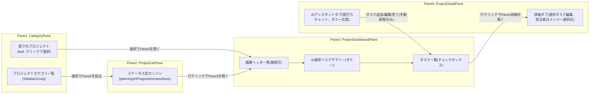

# プロジェクト管理ツール モック実装 — 決定事項と進捗（引き継ぎ用）

このドキュメントは、「**社内のプロジェクト管理ツール**」を作るにあたって、対話（グリル）で決めた全ての意思決定と、モック実装フェーズの進捗をまとめたものです。**別セッションでこの続きを行う際は、まず本ファイルを読んでから作業を再開してください。**

最終更新: 2026-07-03（§10「全体ダッシュボードとAI活用強化」を追加。`npm run dev` / `npm run build` / `npm run test` / `npm run lint` / `npm run check:radius` すべてグリーン）

> **重要な経緯**: 当初は「受託・制作会社向けの案件・プロジェクトポートフォリオ管理ツール」（クライアント→プロジェクトの階層）としてモック実装フェーズ15項目を完了させたが、その後の要件定義変更により「**社内のプロジェクト管理ツール**」（外部クライアントは存在せず、プロジェクトカテゴリで分類する）へとドメインを転換した。本ドキュメントは転換後の最新状態を正としつつ、§9 に転換の経緯を残す。

---

## 1. プロダクト概要

**社内の複数プロジェクトを俯瞰できる、プロジェクト管理ツール**を作る。外部のクライアント・取引先は登場せず、あくまで一つの組織（会社）の中で複数の部署・チームが動かすプロジェクトを管理する。

- 対象ユーザー: 一つの会社（組織）に所属する個人〜複数チーム。組織は「ワークスペース」という単位に分かれ、各ワークスペースの中にメンバーが所属する（§2.4）
- 管理粒度: **プロジェクト単位のポートフォリオ管理**。タスク管理は軽量（Jira/Linearのような重量級タスク管理ではない）
- 俯瞰したい情報: **進捗率・期限リスク**（遅延・期日逼迫）を最優先。予算・工数管理は対象外
- AI機能: ①進捗リスクの自動サマリー、②タスクを対話しながら追加・編集できる「壁打ちアシスタント」
- 組織単位で使うことを前提とし、認証・権限も設計に含める（社内ツールのため個人ワークスペースという概念はそもそも存在しない）

### 開発の進め方（フェーズ分割）

1. **モック実装フェーズ（今ここ）**: ダミーデータで4ペインUI・組織/権限UI・AIチャットUIまで作り込む。バックエンド接続なし
2. **バックエンド実装フェーズ（次）**: Neon + Drizzle でDB接続、Clerkで認証・組織・権限を実配線、Vercel AI SDK + Gemini APIを実接続

---

## 2. 意思決定ログ（グリルで確定した内容）

### 2.1 スコープ・ダッシュボード観点

| 論点                 | 決定                                                 | 理由                                   |
| -------------------- | ---------------------------------------------------- | -------------------------------------- |
| 管理対象             | 社内プロジェクトのポートフォリオ管理（タスクは軽量） | 一つの会社の中での実利用を想定         |
| ダッシュボードの主軸 | 進捗率・期限リスク（遅延・期日逼迫）                 | ポートフォリオ管理で最も頻繁に使う視点 |

### 2.2 4ペイン構成

| Pane      | 内容                                                                                                                                                                                     |
| --------- | ---------------------------------------------------------------------------------------------------------------------------------------------------------------------------------------- |
| **Pane1** | プロジェクトカテゴリ→プロジェクトの階層（`CategoryPane`）。カテゴリの選択が実際に Pane2 を絞り込む                                                                                       |
| **Pane2** | プロジェクト一覧、**ステータス別カンバン**（企画中/進行中/レビュー中/完了の4固定列、D&Dで移動）。行は「プロジェクト名＋進捗率バー＋期限バッジ（遅延は赤強調）」                          |
| **Pane3** | 選択プロジェクトのダッシュボード。上から **①概要ヘッダー帯（カテゴリ・期限・進捗率、開閉可）→ ②AI進捗リスクサマリーカード → ③タスク一覧（チェックボックス、クリックでPane4詳細を開く）** |
| **Pane4** | **タブ切替式**：「詳細」タブ（選択タスクの自由編集、追加・削除可）／「AIアシスタント」タブ（壁打ちチャットでタスク追加・編集・完了まで実行可、**削除のみ手動**）                         |

**Pane1↔Pane2の連動仕様**:

- Pane1で「すべてのカテゴリ」を選択 → Pane2は全件表示
- Pane1でカテゴリ名をクリック → そのカテゴリのプロジェクトのみPane2に表示（再クリックで解除）
- Pane1で個別プロジェクト（leaf）をクリック → そのプロジェクトを選択してPane3を開く（同時に所属カテゴリでの絞り込みも有効になる）

**プロジェクトの削除は Pane2 のみ**（Pane1のツリーには削除ボタンを置かない。同一エンティティに対する重複した削除導線を避けるため）。

**Pane2からのプロジェクト新規追加**は、Pane1でカテゴリが選択されている時のみ有効（`canAddProject`）。カテゴリ未選択時は「+」ボタンをdisabled化し、Tooltipで「先にPane1でカテゴリを選択してください」と案内する。Pane1側の各カテゴリグループの「+」ボタンは常時有効（カテゴリが自明なため）。

**GlobalHeaderのビュー切替**（§10 で追加）: `GlobalHeader`に「ワークスペース／ダッシュボード」のタブを常設し、「ダッシュボード」選択時はPane2〜4のエリアを全体ダッシュボード（`PortfolioDashboardPane`）に差し替える。Pane1（`CategoryPane`）はどちらのビューでも常時表示のまま。ダッシュボード表示中にPane1でカテゴリ／プロジェクトを操作すると、自動的に「ワークスペース」ビューに戻る。

### 2.3 データモデル

| 論点                  | 決定                                                                                    |
| --------------------- | --------------------------------------------------------------------------------------- |
| タスクの項目          | **タイトル・完了フラグ・期限・担当者・メモ**の5項目（優先度・タグ等は入れない）         |
| 担当者の入力方式      | **組織メンバー一覧からの選択式**（自由テキストではない）。§9.3 で確定                   |
| 進捗率の算出方法      | **タスク完了比率から自動計算**（手入力不可）。タスク0件のプロジェクトは0%               |
| アーカイブ機能        | **導入しない**（プロジェクトは直接削除）                                                |
| Pane1のグルーピング軸 | **プロジェクトカテゴリ別**（自由な分類軸、社内の部署・チーム構造とは独立）。§9.1 で確定 |

### 2.4 認証・組織・権限（バックエンドフェーズで実装、モックではUIのみ）

| 論点                       | 決定                                                                                                                                                                        | 理由                                                                                                                                         |
| -------------------------- | --------------------------------------------------------------------------------------------------------------------------------------------------------------------------- | -------------------------------------------------------------------------------------------------------------------------------------------- |
| 認証方式                   | **Clerk**（Google認証・Organizations・ロールを標準機能でカバー）                                                                                                            | 自前で組織/権限テーブルを設計・実装する手間が不要                                                                                            |
| 組織とワークスペースの関係 | **組織 = ワークスペース**。組織ごとに独立したワークスペースに分かれ、ユーザーは複数の組織（ワークスペース）に所属しうる。組織所属を必須化し、個人ワークスペースは許可しない | 「誰のデータか」を曖昧にしないため。初回オンボーディングで組織作成/参加を必須ステップにする（バックエンドフェーズで実装）。§9.2 で改めて確認 |
| ロール粒度                 | **各ワークスペース（組織）内で Owner/Admin/Memberの3段階**（Clerk標準ロール）                                                                                               | 案件単位の細かい権限は将来拡張、まずは標準機能で十分                                                                                         |
| モック段階の権限UI         | ロールは**バッジ表示のみ**（OrgSwitcherの現在ロール表示等）。操作制限（例: 削除はOwner/Adminのみ）は導入しない                                                              | バックエンドフェーズで実権限チェックを実装する際に合わせて設計する。§9.4 で確定                                                              |

### 2.5 AI機能

| 論点                     | 決定                                                                       | 理由                                                                                                              |
| ------------------------ | -------------------------------------------------------------------------- | ----------------------------------------------------------------------------------------------------------------- |
| AI機能の中身             | ①進捗リスクの自動サマリー、②タスクを対話しながら追加する壁打ちアシスタント | ユーザーの要望を具体化                                                                                            |
| AIアシスタントの配置     | **Pane4をタブ化**し「詳細」「AIアシスタント」を切替                        | 既存のPane4Toggle開閉インフラをそのまま流用できる                                                                 |
| **Pane4のAIアクセス性**（§10で追加）  | **プロジェクトを選択した時点（タスク未選択でも）でPane4をAIアシスタントタブで自動的に開く** | 新規プロジェクト作成直後など、タスクが1件もない状態でもすぐAIでタスクを洗い出せるようにするため                    |
| AIチャットの操作範囲     | **タスクの追加・編集・完了チェックまで実行可（削除は手動のみ）**           | 削除はAIの誤推論で大事なタスクが消えるリスクがある一方、追加・編集・完了マークは取り消しが容易                    |
| **タスク洗い出し**（§10で追加）       | チャットで「〇〇のタスクを洗い出して」と話しかけると**複数タスクを一括提案**し、チェックボックスで選択したものだけ「追加」ボタンで確定する（確認ステップあり） | 一括生成は単発の追加より誤操作の影響が大きいため、確認ステップを挟む。確定した分だけ`project.tasks`に反映されPane3にも自動反映される |
| **AI利用料金の負担方式** | **BYOK（Bring Your Own Key）**。プラットフォーム側がAPIキーを提供しない    | 運営側のAIコストが青天井になるのを避けるため（ユーザーからの明示的な要望）                                        |
| APIキーの登録単位        | **ユーザー個人単位**（組織単位ではない）                                   | ユーザーの明示的な選択                                                                                            |
| APIキーの保存先          | **Clerkユーザーの private metadata**（サーバーサイドのみアクセス可）       | Neon側に暗号化カラムやKMSを自前用意する必要がなく、安全に保存できる                                               |
| AIプロバイダ             | **Google Gemini の無料枠** + **Vercel AI SDK**                             | ユーザー指定。Vercel AI SDKは`@ai-sdk/google`でGeminiに対応、ストリーミングチャット・ツール呼び出しを標準サポート |

### 2.6 技術スタック（バックエンドフェーズ）

| 領域         | 決定                                                                                                                 |
| ------------ | -------------------------------------------------------------------------------------------------------------------- |
| DB           | **Neon**（Postgres）                                                                                                 |
| ORM          | **Drizzle**（`@neondatabase/serverless`との相性、Vercel Edge/Serverless両対応、TypeScriptファーストでzodとの親和性） |
| ホスティング | **Vercel**                                                                                                           |
| AI SDK       | **Vercel AI SDK** + **Google Gemini**（BYOK）                                                                        |
| 認証         | **Clerk**（Google認証・Organizations・ロール）                                                                       |

### 2.7 モック段階の作り込み範囲

「まずモック、その後バックエンド」という進め方の中で、**モック段階で組織・権限UI・AIチャットUIまでダミーデータ／ダミー応答で作り込む**と決定（中途半端に一部だけ実装すると、UI/UXを先に固めてからバックエンドに進む利点が薄れるため）。

- 組織スイッチャー・ロール表示: ダミー定数で見た目のみ実装。**組織を切り替えてもプロジェクトデータは切り替わらない**（1セットのダミーデータのまま。§9.2 で確定）
- 組織メンバー一覧: タスク担当者アサインの選択肢として `data/members.json` に用意。メンバー管理UI（追加・削除）はモックの対象外（バックエンドフェーズでClerk Organizations経由に実装）
- Gemini APIキー設定ダイアログ: 入力値はコンポーネントのローカルstateに保持するのみ。実保存（Clerk private metadata）は次フェーズ
- AI進捗サマリー: 期限リスクからテンプレート文を組み立てる簡易ロジック（実LLM呼び出しなし）
- AIアシスタントチャット: 簡易パターンマッチによるダミー応答（実Gemini API呼び出しは次フェーズ）

### 2.8 既存コードの扱い

**クリーンリライト**を選択。採用管理サンプルのコード（Candidate/Position/Scorecardドメイン）は参照用に残さず削除し、新ドメイン（Category/Project/Task/Member）のコードに置き換える。§9 の転換でも同様に、旧ドメイン（Client）のコードは参照用に残さず削除している。

---

## 3. アーキテクチャ図



---

## 4. データモデル（確定・実装済み）

`lib/schema.ts` に実装済み。

```ts
type Category = { id: string; name: string }; // Pane1 のグルーピング軸（社内の分類タグ）

type Role = "owner" | "admin" | "member"; // ワークスペース内の3段階ロール（Clerk標準ロール想定）

type Member = { id: string; name: string; role: Role }; // 組織メンバー。タスク担当者はここから選択する

type ProjectStatusKey = "planning" | "inProgress" | "review" | "done"; // 企画中/進行中/レビュー中/完了
const STATUS_ORDER: ProjectStatusKey[] = [
  "planning",
  "inProgress",
  "review",
  "done",
];

type Task = {
  id: string;
  title: string;
  done: boolean;
  dueDate: string;
  assigneeId: string; // Member.id への参照。未アサインは空文字
  memo: string;
};

type Project = {
  id: string;
  name: string;
  categoryId: string; // Category.id への参照
  status: ProjectStatusKey;
  deadline: string;
  tasks: Task[];
  // 進捗率・期限リスクはフィールドに持たず、lib/computed/projects.ts で都度導出する
};

// Pane4 の表示状態（選択中タスク or 未選択）
type SelectedDetail = { type: "task"; taskId: string } | null;
type Pane4Tab = "detail" | "ai";

// Pane2 の派生表示型
type DeadlineRisk = "overdue" | "dueSoon" | "onTrack" | "none";
type ProjectRow = {
  id: string;
  name: string;
  progress: number;
  deadline: string;
  deadlineRisk: DeadlineRisk;
};
type Group = { status: ProjectStatusKey; label: string; items: ProjectRow[] };
```

派生計算（`lib/computed/projects.ts`）:

- `getProjectProgress(project)`: 完了タスク数 ÷ 総タスク数 × 100（0件は0%）
- `deriveDeadlineRisk(deadline, referenceDate?)`: 期限未設定→`none` / 超過→`overdue` / 残り7日以内→`dueSoon` / それ以外→`onTrack`（`date-fns`の`differenceInCalendarDays`を使用）
- `getTaskCounts(project)`: 完了数・総数

担当者名の解決（コンポーネント側のパターン）:

- タスクは `assigneeId`（`Member.id`）のみを持ち、表示名は呼び出し側で `members.find((m) => m.id === task.assigneeId)?.name` により都度解決する（非正規化して保存しない）
- Pane4「詳細」タブの担当者編集は `InlineSelectField`（メンバー名の配列を選択肢として渡し、選択された名前からメンバーを逆引きして `assigneeId` を保存）で実装。新規メンバーのその場追加はできない（メンバー管理はバックエンドフェーズでClerk Organizations経由に実装するため、モックでは固定のメンバー一覧から選ぶのみ）

---

## 5. 実装状況（ファイル単位）

### 5.1 完了済み

| 状態 | ファイル                                        | 内容                                                                                                                                                                                                                                                                                                                                               |
| ---- | ----------------------------------------------- | -------------------------------------------------------------------------------------------------------------------------------------------------------------------------------------------------------------------------------------------------------------------------------------------------------------------------------------------------- |
| ✅   | `lib/schema.ts`                                 | Category/Role/Member/Project/Task/ProjectStatus/SelectedDetail/Pane4Tab/MainView/Group/ProjectRow 型（`MainView`は§10で追加）                                                                                                                                                                                                                      |
| ✅   | `lib/labels.ts`                                 | `ROLE_LABEL`・`STATUS_LABELS`・`PANE3_SECTION`・`PANE4_SECTION_IDS`・`DEADLINE_RISK_LABEL`・`AI_SUMMARY_TEMPLATES`・`AI_CHAT_GREETING`・`AI_CHAT_FALLBACK`・`MAIN_VIEW_LABEL`・`PORTFOLIO_DASHBOARD_TITLE`・`buildAiTaskProposalTitles`（末尾3つは§10で追加）                                                                                       |
| ✅   | `lib/computed/projects.ts`                      | `getProjectProgress`/`deriveDeadlineRisk`/`getTaskCounts`/`getStatusCounts`（`getStatusCounts`は§10で追加、全体ダッシュボード用）                                                                                                                                                                                                                  |
| ✅   | `lib/utils.ts`                                  | `parseISODate`/`formatISODate`（`InlineDateField.tsx` が依存）                                                                                                                                                                                                                                                                                     |
| ✅   | `lib/data/factories.ts`                         | `createMinimalTask(title)`（`assigneeId: ""`で初期化） / `createEmptyProject(categoryId, name, status?)`                                                                                                                                                                                                                                           |
| ✅   | `data/categories.json`                          | プロジェクトカテゴリ4件（プロダクト開発／社内システム／マーケティング・広報／コーポレート・バックオフィス）                                                                                                                                                                                                                                        |
| ✅   | `data/members.json`                             | 組織メンバー5件（owner 1名・admin 1名・member 3名）                                                                                                                                                                                                                                                                                                |
| ✅   | `data/projects.json`                            | プロジェクト8件（categoryIdで紐付け、4ステータスに分散、各1〜4タスク。assigneeIdはmembers.jsonのメンバーを参照。期限は起算日2026-07-03を基準に overdue/dueSoon/onTrack/未設定が混在するよう設計済み）                                                                                                                                              |
| ✅   | `data/workspace.json`                           | `{ "name": "プロジェクト管理", "icon": "layout-dashboard" }`                                                                                                                                                                                                                                                                                       |
| ✅   | shadcn部品                                      | `tabs`・`progress`・`checkbox`（`npx shadcn@latest add`済み）                                                                                                                                                                                                                                                                                      |
| ✅   | `components/workspace/CategoryPane.tsx`         | Pane1。プロジェクトカテゴリ→プロジェクト階層、「すべてのカテゴリ」リセット項目、カテゴリ名クリックで`onSelectCategory`、プロジェクトleafクリックで`onSelectProject`。プロジェクトの追加のみ（削除ボタンはPane2に集約）                                                                                                                             |
| ✅   | `components/workspace/ProjectListPane.tsx`      | Pane2。4固定ステータス列のカンバン、dnd-kitでD&D、`canAddProject`で追加ボタンのdisabled制御、削除は`DeleteConfirmDialog`で確認                                                                                                                                                                                                                     |
| ✅   | `components/workspace/SortableProjectRow.tsx`   | プロジェクト名＋期限バッジ（1行目）、進捗率バー＋数値（2行目）の2行レイアウト                                                                                                                                                                                                                                                                      |
| ✅   | `components/workspace/ProjectDashboardPane.tsx` | Pane3。概要ヘッダー帯（Collapsible）→AI進捗サマリーカード→タスク一覧カードの3構成。タスク行の担当者表示は`members`から名前解決                                                                                                                                                                                                                     |
| ✅   | `components/workspace/ProjectDetailPane.tsx`    | Pane4。`Tabs`で「詳細」（選択タスク編集、担当者は`InlineSelectField`によるメンバー選択式、削除は手動）／「AIアシスタント」（壁打ちチャット、ダミー応答）を切替。AIアシスタントは「〇〇のタスクを洗い出して」で複数タスクを一括提案し、チェックボックス選択＋「追加」ボタンで確定する`TaskProposalBubble`を持つ（§10で追加）                          |
| ✅   | `components/workspace/PortfolioDashboardPane.tsx` | 全体ダッシュボード（§10で追加）。GlobalHeaderの「ダッシュボード」タブ選択時にPane2〜4のエリアを差し替えて表示。`getStatusCounts`によるステータス別プロジェクト件数をカード4枚で表示                                                                                                                                                              |
| ✅   | `components/workspace/OrgSwitcher.tsx`          | ダミー組織2件（社内ツール向けの会社名）を`DropdownMenu`で切替表示のみ（実フィルタなし）。`ROLE_LABEL`を`lib/labels.ts`と共有                                                                                                                                                                                                                       |
| ✅   | `components/workspace/ApiKeySettingsDialog.tsx` | Gemini APIキー入力（ローカルstateのみ、実保存は次フェーズ）                                                                                                                                                                                                                                                                                        |
| ✅   | `components/workspace/GlobalHeader.tsx`         | `OrgSwitcher`・「ワークスペース／ダッシュボード」の`Tabs`切替（§10で追加）・2階層パンくず（カテゴリ名／プロジェクト名、ワークスペースビューのみ表示）・`UserMenu`（Avatar+DropdownMenu、Gemini APIキー設定/プロフィール/ログアウト）                                                                                                              |
| ✅   | `components/workspace/SettingsDialog.tsx`       | 「プロジェクトカテゴリ」の追加・削除＋ワークスペース名編集。props は `categories`/`onAddCategory`/`onDeleteCategory`                                                                                                                                                                                                                               |
| ✅   | `components/workspace/Workspace.tsx`            | 新ドメインのstate/ハンドラで全面実装（§9.5 対応表参照）。`mainView`（ワークスペース/ダッシュボード切替）と、タスク未選択でもプロジェクト選択時にPane4をAIタブで開く独立した`pane4Open`状態を追加（§10で追加）                                                                                                                                       |
| ✅   | `app/page.tsx`                                  | `categories.json`/`members.json`/`projects.json`/`workspace.json` を対応するzodスキーマでparseする形に実装済み                                                                                                                                                                                                                                     |
| ✅   | `__tests__/`                                    | `schema.test.ts`（Category/Role/Member/Project/Task）・`projects.test.ts`（`getProjectProgress`/`deriveDeadlineRisk`/`getTaskCounts`/`getStatusCounts`のユニットテスト）・`utils.test.ts`（`parseISODate`/`formatISODate`）・`labels.test.ts`（`buildAiTaskProposalTitles`、§10で追加）・`page.test.tsx`（Workspaceの実レンダリング確認）。`setup.ts` に `matchMedia`/`ResizeObserver`/`getAnimations` の jsdom 向けスタブを追加 |

### 5.2 残タスク

なし。`npm run dev`・`npm run build`・`npm run test`（35 tests）・`npm run lint`・`npm run check:radius` はすべてグリーンを確認済み。次のステップは第8章「対象外（次フェーズ = バックエンド実装）」を参照。

補足: テスト実行環境について、リポジトリの `node_modules` は Node 20.19 未満では `vitest.config.ts` の読み込みに失敗する（`vite@7` がフルESMのため `require(esm)` サポートが必要）。ローカルの Node が古い場合は、Node 22 LTS 等に切り替えてから `npm run dev` / `npm run test` を実行すること。

---

## 6. Pane4 担当者フィールドの実装メモ

タスクの担当者を「自由テキスト」から「組織メンバーからの選択式」に変更した際の実装パターン（§9.3 の決定を受けたもの）。将来同様のメンバー参照フィールドを追加する際の参考にする。

- `Task.assigneeId` は `Member.id`（未アサインは空文字）を持つのみで、表示名を非正規化して保存しない
- 既存の `InlineComboboxField`（検索+新規追加）ではなく `InlineSelectField`（固定リストSelect）を採用。理由: メンバーは組織所属者の固定集合であり、タスク編集画面からその場で新規メンバーを作る運用は想定しない（メンバー管理はバックエンドフェーズでClerk Organizations経由に実装するため）
- `InlineSelectField` は `value`/`options` が同じ文字列（ラベル）である前提のAPIのため、`id`↔`name` の変換は呼び出し側（`ProjectDetailPane.tsx`）で行う: 選択肢は `[UNASSIGNED_LABEL, ...members.map((m) => m.name)]`、保存時は選ばれた名前からメンバーを逆引きして `assigneeId` を `onUpdateField` に渡す
- 新しい shadcn 部品・variant・トークンの追加は不要だった（既存の `InlineSelectField` の使い方の工夫のみで実現）

---

## 7. 未使用に戻った実装パターン（参考）

`InlineComboboxField`（検索+その場で新規オプション追加できるコンボボックス）は、担当者フィールドの実装変更に伴い `ProjectDetailPane.tsx` からは使われなくなった。プリミティブ自体は `components/primitives/` に残しており、将来「値の集合が固定されておらず、その場で選択肢を増やしたい」フィールド（例: 応募経路・タグ等）が必要になった際に再利用できる。

---

## 8. 対象外（次フェーズ = バックエンド実装）

以下はモック実装フェーズのスコープ外。次のプランニングで別途タスク分解する。

> **バックエンド実装フェーズ着手（2026-07-03）**: 以下の項目を、内容がぶれないようセクション分割したプロンプト集として [docs/backend-implementation-plan.md](./backend-implementation-plan.md) にまとめた。実装セッションはこのファイルの各セクションのプロンプトを使って進める。

- Clerk（Google認証・Organizations・ロール）の実インストール・実配線
- 組織メンバーの実管理（招待・削除・ロール変更）。モックでは `data/members.json` の固定データのみ
- Neon + Drizzle のスキーマ定義・接続・マイグレーション
- Vercel AI SDK + Gemini の実API呼び出し
- BYOKキーの実保存（Clerk private metadataへの読み書きAPI）
- ロールに基づく操作制限の実装（例: 削除はOwner/Adminのみ）。モックではバッジ表示のみ
- 既存 `README.md` / `CLAUDE.md` の記述更新（現状は採用管理サンプル前提の記述が残っている。ドメイン変更が完了した段階で更新を検討）

---

## 9. 社内プロジェクト管理ツールへの転換（2026-07-03）

モック実装フェーズ15/15完了後、要件定義を「受託・制作会社向けの案件管理」から「**社内のプロジェクト管理ツール**」に変更する意思決定を行った。この章に、転換にあたって確認した論点と決定を残す（他章の内容は転換後の状態に更新済みで、本章は経緯の記録）。

### 9.1 Pane1のグルーピング軸: クライアント → プロジェクトカテゴリ

社内ツールには外部の「クライアント（取引先）」が存在しないため、Pane1のグルーピング軸を再検討した。

| 選択肢                           | 内容                                          | 採否     |
| -------------------------------- | --------------------------------------------- | -------- |
| 部署/チーム別                    | 社内組織構造（開発部/営業部等）に合わせる     | 不採用   |
| **プロジェクトカテゴリ・タグ別** | 自由な分類軸（プロダクト開発/社内システム等） | **採用** |
| グルーピング廃止                 | Pane1をなくしフラット一覧に統合               | 不採用   |

理由: 部署/チーム別は社内の組織図と1:1に縛られてしまい、部署をまたぐプロジェクトや将来の組織変更に弱い。カテゴリ・タグ別は分類の自由度が高く、既存のPane1↔Pane2連動フィルタの仕組み（旧クライアント実装）をそのまま転用できる。

### 9.2 組織とワークスペースの関係

「各組織ごとのワークスペースに分かれ、そのワークスペースの中に3段階の権限（Owner/Admin/Member）がある」という要望を確認し、**組織 = ワークスペース**（1組織が1つの独立したワークスペースを持ち、ユーザーは複数の組織に所属しうる）という既存の設計（§2.4）と一致することを確認した。

モックの`OrgSwitcher`（組織切替）は、これまで通り**見た目のみのダミー切替**とする（切り替えてもプロジェクトデータは1セットのまま）。実際に組織ごとに別データセットを持たせる実装は行わない。理由: 複数データセットの用意はモックの複雑度を上げる一方、UI/UX検証という目的に対する追加価値が小さいため。実データ分離はバックエンドフェーズでDB上の組織スコープとして自然に実現される。

### 9.3 タスク担当者: 自由テキスト → 組織メンバーからの選択式

社内ツールでは実在する社員（組織メンバー）が担当者になるため、担当者を自由テキストから組織メンバー一覧の選択式に変更した。

- `data/members.json` を新設し、`Member { id, name, role }` の固定データ（5名）を用意
- `Task.assignee: string`（自由テキスト）を `Task.assigneeId: string`（`Member.id` への参照）に変更
- 実装パターンの詳細は §6 を参照

メンバーの追加・削除・ロール変更などの管理機能はモックの対象外とし、バックエンドフェーズでClerk Organizations経由に実装する（§8）。

### 9.4 ロールに基づく操作制限

Owner/Admin/Memberの3ロールについて、モック段階で操作制限（削除はOwner/Adminのみ等）まで作り込むかを検討し、**バッジ表示のみに留め、操作制限は実装しない**と決定した。理由: 権限チェックの実体はバックエンド（Clerkのロール情報）に依存するため、モックで先に制限UIを作り込んでも、バックエンドフェーズで権限モデルの詳細（例: プロジェクト単位の権限が必要か）が固まった時点で作り直しになる可能性が高い。

### 9.5 `Workspace.tsx` 新旧対応表（クライアント→カテゴリ転換）

| 旧 state/handler（クライアントドメイン） | 新 state/handler（カテゴリドメイン）                                        |
| ---------------------------------------- | --------------------------------------------------------------------------- |
| `clients: Client[]`                      | `categories: Category[]`                                                    |
| `selectedClientId`                       | `selectedCategoryId`                                                        |
| `onSelectClient`                         | `onSelectCategory`                                                          |
| `addClient`/`deleteClient`               | `addCategory`/`deleteCategory`                                              |
| `project.clientId`                       | `project.categoryId`                                                        |
| `task.assignee`（自由テキスト）          | `task.assigneeId`（`Member.id`参照）                                        |
| （なし）                                 | `members: Member[]`（`initialMembers` props で受け取り、Pane3/Pane4に渡す） |

### 9.6 見た目（配色・レイアウト）の扱い

「UIを刷新する」という要望は、**ドメイン用語・データを社内ツール向けに置き換えることが中心**であり、配色・レイアウトの基本構造（4ペイン構成・shadcn/base-uiのデザインシステム・`app/globals.css`のトークン）は維持する、という方針を確認した。そのため本転換では新しいCSS変数・shadcn variant・レイアウトパターンの追加は行っていない。

---

## 10. 全体ダッシュボードとAI活用強化（2026-07-03）

モック実装フェーズ完了・§9のドメイン転換完了後、追加要望として「①複数プロジェクトを横断する全体ダッシュボードが欲しい」「②タスクの洗い出しにAIを活用したい」の2点を受け、ヒアリングの上で以下を決定した。

### 10.1 全体ダッシュボードの新設

既存のPane3（プロジェクト個別ダッシュボード）とは別に、**カテゴリ横断で全プロジェクトを俯瞰する「全体ダッシュボード」**を追加する。

| 論点             | 決定                                                                                              | 理由                                                                             |
| ---------------- | --------------------------------------------------------------------------------------------------- | -------------------------------------------------------------------------------- |
| 配置・切替方法   | `GlobalHeader`に「ワークスペース／ダッシュボード」の`Tabs`を常設し、選択中はPane2〜4のエリアを`PortfolioDashboardPane`に丸ごと差し替える | 既存レイアウトを壊さず、必要な時だけ全画面で見られる。Pane4で既に使っている`Tabs`部品を再利用でき新規部品が不要 |
| Pane1の扱い      | ダッシュボード表示中も`CategoryPane`（Pane1）は常時表示のまま。Pane1でカテゴリ/プロジェクトを操作すると自動的に「ワークスペース」ビューに戻る | Pane1からの操作導線を迷わせないため                                              |
| 表示内容         | **ステータス別プロジェクト件数**（企画中/進行中/レビュー中/完了）のみ                              | ヒアリングでスコープを絞った。件数はカード4枚で表示し、`getStatusCounts`（`lib/computed/projects.ts`）で算出 |

実装: [components/workspace/PortfolioDashboardPane.tsx](../components/workspace/PortfolioDashboardPane.tsx)（新規）、`lib/schema.ts`の`MainView`型、`Workspace.tsx`の`mainView` state。

### 10.2 Pane4のAIアクセス性向上

従来はPane3でタスクを選択して初めてPane4が開き、「AIアシスタント」タブに到達できた。これだと新規プロジェクト作成直後（タスクが1件もない状態）にAIを使いにくいという課題があったため、次の通り変更した。

- Pane1またはPane2でプロジェクトを選択した時点（タスク未選択でも）で、Pane4を**「AIアシスタント」タブを開いた状態**で表示する
- Pane3でタスクを選択した場合は従来通りPane4を「詳細」タブで開く
- 上記の切替のため、`pane4Open`を`selectedDetail`から独立したstateに変更した（旧`pane4ManuallyClosed`は廃止）

### 10.3 AIタスク洗い出し（複数タスク一括提案）

「プロジェクトのタスクを洗い出して一覧を作成する際にもAIを活用したい」という要望を受け、Pane4「AIアシスタント」チャットに次の機能を追加した。

- チャットで「〇〇のタスクを洗い出して」（〇〇は省略可）と話しかけると、AIが複数のタスク候補を一括提案する
- 提案は**チェックボックス付きのリストとしてチャット内に表示**され、デフォルトで全選択。ユーザーが選んだものだけ「選択した◯件を追加」ボタンで確定する（**確認ステップを挟む**。単発の「〇〇を追加して」は従来通り確認なしの即時実行のまま据え置き）
- 確定すると`onAddTask`経由で`project.tasks`に反映され、Pane3のタスク一覧にも自動的に反映される（状態はWorkspace.tsxに一元化されているため、Pane3側の追加配線は不要）
- モック段階では実LLM呼び出しはせず、固定の候補タイトル5件（`buildAiTaskProposalTitles`、`lib/labels.ts`）をトピック文字列でプレフィックスするダミーロジックで代替する。実際のGemini API接続はバックエンドフェーズで対応する

実装: [components/workspace/ProjectDetailPane.tsx](../components/workspace/ProjectDetailPane.tsx)の`TaskProposalBubble`・`ChatMessage`型（判別可能ユニオンに変更）。
